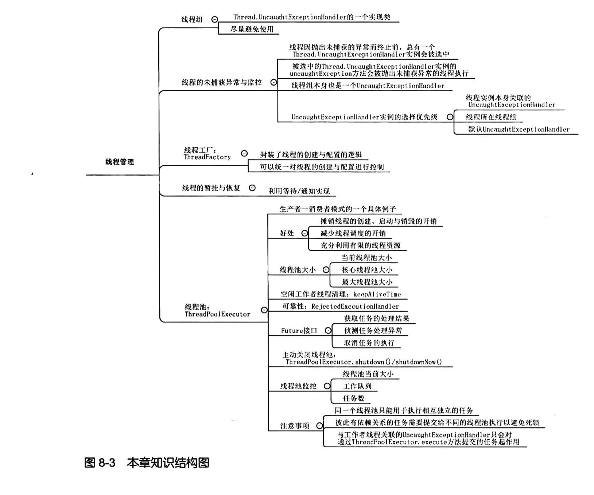
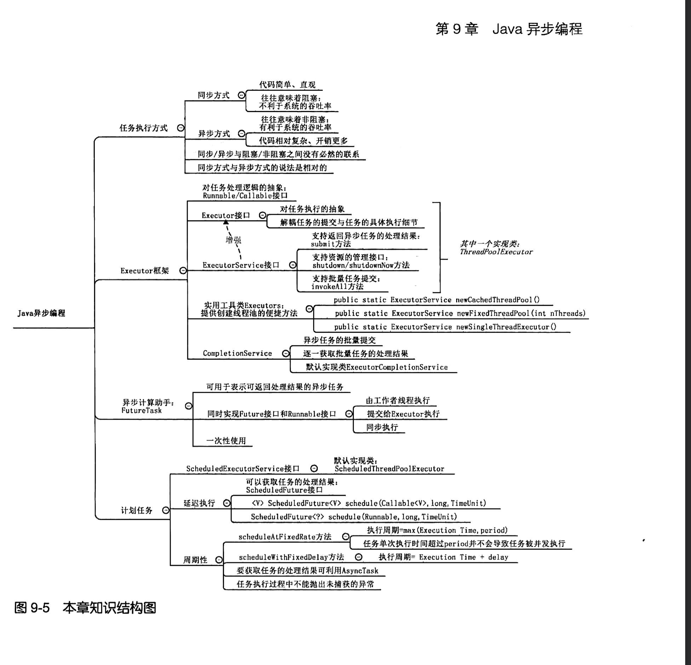

#  java多线程编程实战指南

---

## 第1章

---

### 1.1 进程、线程与任务

**进程**

**进程是程序运行的实例**。进程好比正在播放的视频，程序是视频文件。前者从动态的角度刻画事物，后者从静态的角度刻画事物。一个运行的Java程序就是一个Java虚拟机进程

**线程**

**进程是程序向操作系统申请资源的基本单位，线程是进程中可独立执行的最小单元。**例如一个文件下载的进程可以同时调用多个线程，这些线程独立下载一段数据

### 1.2 多线程编程简介

多线程编程是指以线程为基本抽象单位的一种编程范式

### 1.3 Java线程

#### 1.3.1 线程的创建、启动与运行

在Java平台中创建一个线程就是创建一个**Thread类（或其子类的实例）**

每个线程都有其要执行的任务，这些任务的处理逻辑可以**在Thread类的run方法中直接实现或通过该方法进行调用**，run方法由虚拟机运行相应线程时直接调用，而不是由应用代码进行调用

Thread类的start方法是启动一个线程，其实质是请求虚拟机运行相应的线程，而这个线程何时运行时由线程调度器决定的

**Thread类的两个构造器的使用**

1. Thread():实现子类，并在子类中重写run方法

   ```java
   //定义Thread的子类，并重写其run方法
   public class WelcomeThread extends Thread {
       @Override
       public void run() {
           System.out.println("WelcomeThread...run...");
       }
   }
   //在主方法中调用start方法启动线程
   public class WelcomeApp {
       public static void main(String[] args) {
           Thread welcomeThread = new WelcomeThread();
           welcomeThread.start();
           System.out.println("WelcomeApp...main...");
       }
   }
   ```

2. Thread(Runnable target):创建Runnable接口实例的方式创建线程

   ```java
   //实现Runnable接口，并覆盖其run方法
   public class WelcomeTask implements Runnable {
       @Override
       public void run() {
           System.out.println("WelcomeTask...run...");
       }
   }
   //主方法，使用Thread(Runnable target)构造器构造线程
   public class WelcomeApp1 {
       public static void main(String[] args) {
           Thread thread = new Thread(new WelcomeTask());
           thread.start();
           System.out.println("WelcomeApp1...main...");
       }
   }
   ```


不管使用哪种方式创建线程，一旦线程的run方法执行（由Java虚拟机调用）结束，响应的线程运行也就结束。**一个线程的start方法只能被调用一次，一个线程结束后就不能再次调用它的start方法**

在Java中万事万物皆对象，线程也不例外。不过线程与普通对象不同，**Java虚拟机会为每个线程分配调用栈所需的内存空间**，其创建成本比创建一个普通对象的成本要高些

值得注意的是，run方法一般是由虚拟机进行调度执行，但是我们也可以直接调用run方法，不过一般情况下，我们不这样做

#### 1.3.2 Runnable接口

Runnable接口中只有一个run方法，线程的任务逻辑体现在run方法之中。Thread类实际上是Runnable接口的一个实现类，其run方法是对Runnable接口的重写

```java
//Thread类的run方法源码    
@Override
    public void run() {
        if (target != null) {
            target.run();
        }
    }
```

源码如上，其中target是Thread类的一个字段，类型为Runnable。如果该字段不为空则直接通过target调用run方法（也就是我们使用第二种构造器实现）

Thread类的run方法决定了创建线程的两种方式：一种是子类重写run方法（通过继承的方式）；另一种是初始化target字段，通过target调用run方法（基于组合实现）

**线程两种创建方式的区别**

* 第一种方式是一种基于继承的技术，第二种创建方式是一种基于组合的技术。由于组合相对继承来说，其类与类之间的耦合性更低，因此，它也更灵活，在同样的情况下，优先选择
* 从对象共享角度来看，第二种创建方式可以多个线程共享同一个Runnable实例，也就是说Runnable中的字段也是共享的
* 从创建成本来看，Java中的线程实例是一个特殊的Runnable实例，Java虚拟机会为其分配调用栈空间、内核线程等资源。创建一个线程实例比创建一个普通Runnable实例来说，成本要昂贵些。因此，如果创建Runnable实例再将其作为方法参数传递给其他对象使用而不必利用它来创建相应的线程（第二种方式），那么优先考虑创建一个Runnable实例

#### 1.3.3 线程属性

|        编号        |             只读属性，long类型。用于标识不同线程             | 只在Java虚拟机一次运行有效，重启一个Java虚拟机后，该编号可能会改变 |
| :----------------: | :----------------------------------------------------------: | :----------------------------------------------------------: |
|     编号（ID）     |             只读属性，long类型。用于标识不同线程             | 只在Java虚拟机一次运行有效，重启一个Java虚拟机后，该编号可能会改变 |
|    名称（Name）    |        可读可写，String类型，默认格式是“Thread-编号”         |               可以自己通过调用线程方法进行设置               |
| 线程类别（Daemon） | 可读可写，boolean类型。当为true是为守护线程，false为用户线程。默认值与父线程一致 |          必须在start方法前调用setDaemon方法进行设置          |
| 优先级（Priority） |  可读可写，int类型。1~10个优先级，默认是5，默认与父线程一致  |                 如果设置不当，会造成线程饥饿                 |

Java线程的优先级本质是个线程调度器的一个提示，以便于线程调度器决定优先调度那些线程运行。但是，**它并不能保证线程按照其优先级高低顺序运行，如果线程优先级使用不当可能导致线程饥饿**

Daemon属性设置线程为守护线程还是用户线程。用户线程可以阻止Java虚拟机的正常停止，虚拟机只有在所有用户线程都结束时才能正常停止；而守护线程不会影响Java虚拟机的退出，即使有守护线程在运行，Java虚拟机也可以正常停止

#### 1.3.4 Thread类的常用方法

**void join()**

等待响应线程运行结束。如果线程A调用线程B的join方法，那么线程A的运行会被暂停，直到线程B运行结束

**static void yield()**

使当前线程主动放弃对处理器的占用，当前线程可能被暂停

**static void sleep(long millis)**

使当前线程休眠指定时间

### 1.4 无处不在的线程

Java虚拟机垃圾回收器负责对Java程序中不再使用的内存空间进行回收，回收动作实际也是专门的线程实现的，**垃圾回收线程由Java虚拟机自行创建**。从垃圾回收角度看，线程也可以分为垃圾回收线程和应用线程（开发中创建的）

### 1.5 线程的层级关系

如果在A线程中创建了B线程，那么A线程就是B线程的**父线程**；同理B线程就是A线程的**子线程**

一个线程是用户线程还是守护线程默认情况下取决于其父线程。父线程是守护线程则子线程默认也是守护线程；父线程是用户线程则子线程也是守护线程

父线程和子线程之间的生命周期是相互独立的，也就是父线程结束，子线程仍然可以独立运行；反之亦然

默认情况下，子线程的优先级与父线程一致

**工作者线程**

父线程专门创建来负责某项任务的子线程叫工作中线程或后台线程。例如Web中doGet（doPost）方法中的线程或者虚拟机中的垃圾回收线程

### 1.6 线程的生命周期状态


Java线程的状态可以通过Thread.getState()方法来获取，该方法的返回值是一个枚举类型

* **NEW**：一个已创建而未启动的线程位于该状态

* **RUNNABLE**：该状态包含两个子状态

  * **READY**：表示该线程可以被线程调度器进行调度而使之处于RUNNING状态，处于READY的线程也称为活跃线程
  * **RUNNING**：表示该线程正在运行，即对应的run方法所对应的指令正在由处理器执行

  执行yield方法，其状态可能会由RUNNING转换为READY

* **BLOCKED**：一个线程发起一个**阻塞式I/O操作（例如文件读写或者Socket读写）后，或者申请一个其他线程持有的资源（例如锁）**，线程就会处于BLOCKED状态。处于该状态的线程不会占用处理器资源，当线程完成I/O操作或者获得锁后又可以转换为RUNNABLE状态

* **WAITING**：线程执行某些特定方法后就会处于这种等待其他线程执行另外一些特定操作的状态。例如执行Thread.join()、Object.wait()和LockSupport.park(Object)方法；对应的执行Object.notify()/notifyAll和LockSupport.unpark(Object)可以使线程由WAITING状态转换为RUNNABLE状态

* **TIMED_WAITING**：该状态类似于WAITING状态，不过处于该状态的线程可以不经其它线程执行特定操作，而是处于有限时间的等待中，若时间到了自动会转换为RUNNABLE

* **TERMINATED**：已经执行结束的线程处于该状态。一个线程只能一次处于该状态。Thread.run()正常返回或抛出异常而提前终止都会使线程处于该状态

一个线程在整个生命周期中，只可能有一次处于NEW和TERMINATED状态


## 第2章

---

### 2.1 串行、并发与并行

如果有A，B，C三件事代办，串行、并发和并行的区别在于：

* **串行**：执行事件A、B、C时必须完成一个才能执行另一个。系统只能允许一个事件存在
* **并发**：执行A事件到一半，执行B事件；然后执行B事件到一半又可以去完成C事件。也就是说，系统允许两个或多个事件同时存在
* **并行**：可以同时开始执行A、B、C事件。也就是系统允许同时执行多个事件

**从软件开发的角度来看，并发就是在一段时间内以交替的方式去完成多个任务，而并行就是以齐头并进的方式去完成多个任务**

### 2.2 竞态

#### 2.2.1 解释竞态的结果

竞态产生的原因：**多个线程在没有任何控制措施的情况下并发地更新、读取同一个共享变量**

关于操作**“i++”**的说明，这看起来是一个操作，实际上相当于如下伪代码所示的3个指令

```java
load(i,r1);//① 将变量i的值从内存读到寄存器r1
increament(r1);//② 将寄存器的值增加1
store(i,r1);//③ 将寄存器r1的内容写入变量i对应的内存空间
```

**竞态不一定会导致错误的结果，但是竞态的结果具有不确定性。竞态往往伴随着读取脏数据的问题，即线程读取到一个过时的数据、丢失更新问题**

#### 2.2.2 竞态的模式与竞态产生的条件

竞态的两种模式

1. **read-modify-write（读-改-写）**

例如上面的**“i++”**操作，一个线程在执行完①，准备开始②这段时间中，其它线程可能会已经更新了i的值，这就使得该线程在执行指令②的时候使用的是共享变量的旧值，此时该线程继续执行③操作就会对共享变量造成覆盖，从而产生数据丢失等问题

2. **check-then-act（检测而后行动）**

```java
if (sequence >= 999)//子操作①，check
    sequence = 0;//子操作②，act
else
    sequence ++;
```

例如上面的演示代码，一个线程在执行完自操作①到开始自操作②这段时间内，其它线程可能已经更新了共享变量的值，使if条件变得不成立，但是此线程仍然会执行②操作

注意，**对于局部变量（包括形式参数和方法体内定义的变量），由于不同的线程各自访问的是各自的那一份局部变量，因此局部变量的使用不会导致竞态**

### 2.3 线程安全性

**线程安全性**

如果一个类在单线程环节下能够运行正常，并且在多线程环境下，在使用时不做任何改变也能正常运行，那么我们就称其为线程安全的；相应的，如果一个类在单线程环境下能够正常运行而多线程环境下无法正常运行，那么此类就是非线程安全的。如果一个类能产生静态，那么它就是非线程安全的

例如Java标准库中如ArrayList、HashMap和SimpleDateFormat都是非线程安全的。比如多线程情况下共享一个HashMap实例可能导致死循环和内存泄漏

线程的安全问题可以概括为3个方面：**原子性、可见性和有序性**

### 2.4 原子性

**原子性的定义**：对于涉及共享变量访问的操作，若该操作从其执行线程以外的任意线程来看是**不可分割的**，那么该操作就是原子操作，相应地我们称该操作具有原子性

**不可分割的其中一个含义**是指访问某个共享变量的操作从其执行线程以外的任何线程来看，该操作要么已经执行结束要么没发生，即其它线程不会“看到”该操作执行了部分的中间效果；

**不可分割的另一个含义**是，设O1和O2是访问共享变量V的两个原子操作，这两个操作并非都是读操作。那么一个线程执行O1期间（开始执行而未执行完毕），其它线程无法执行O2。**也就是说，访问同一组共享变量的原子操作时不能被交错的**，这就排除了一个线程执行一个操作一个操作期间另外一个线程读取或更新访问共享变量而导致的干扰

* 原子操作仅针对共享变量而言。局部变量的访问不涉及原子性，或者说都是原子操作
* 原子操作时从该操作的执行线程外的线程来描述的。也就是在多线程环境下才有意义

**Java中有两种方式实现原子性**

1. **使用锁**。锁具有排他性，能保障一个共享变量在任意一个时刻只能被一个线程访问
2. **利用处理器提供的专门CAS指令**。CAS指令实现原子性的方式与锁实现原子性的方式实质上时相同的，差别在于锁通常是在软件层面实现的，而CAS是直接在硬件层面实现的，可以看做“硬件锁”

在Java语言中，**long类型和double类型以外的任何类型的变量的写操作都是原子性的**（例如byte、boolean、short、char、float、int的写操作都是原子的）

**为什么long和double类型的操作不是原子性的？**

这是因为long/double型变量是64位的，在32位Java虚拟机中对这种变量的写操作可能被分为两个步骤来实施，比如先写低32位的再写高32位。此时，如果多个线程在处理这种类型的变量时就可能出现一个线程在写高32位的时候，另外一个线程正在写低32位的情况

**volatile关键字**

对于使用volatile关键字修饰的long/double变量的写操作具有原子性，但是它不能保障其他操作（比如read-modify-write操作和check-then-act操作）的原子性

### 2.5 可见性

**可见性的定义**：如果一个线程对某个共享变量进行更新之后，后续访问该变量的线程可以读取到该更新结果，那么就称这个线程对该共享变量的更新对其他线程可见，否者我们就称这个线程对该共享变量的更新对其他线性不可见

对于同一个共享变量而言，一个线程更新了该变量的值后，其他线程能够读取到这个更新后的值，那么这个值就被称为该变量的**相对新值**。如果读取这个共享变量的线程在读取并使用该变量的时候其他线程无法更新该变量的值，那么该线程读取到的相对新值就被称为该变量的**最新值**

**可见性的保障仅仅意味着一个线程能够读取到共享变量的相对新值，而不能保障该线程能够读取到响应变量的最新值**

**注意**：

1. Java语言规范保证，**父线程在启动子线程之前对共享变量的更新对于子线程是可见的**

例如下面的Demo，data赋值为1时，对于子线程而言是可见的

```java
public class ThreadStartVisibility {
    static int data = 0;

    public static void main(String[] args) {
        Thread thread = new Thread() {
            @Override
            public void run() {
                Tools.randomPause(50);
                System.out.println(data);
            }
        };
        data = 1;
        thread.start();
        Tools.randomPause(50);
        data = 2;//如果注释掉，那么输出一定是1；如果不注释，那么输出可能是1可能是2
    }
}
```

2. Java语言规范保证一个线程终止后该线程对共享变量的更新对于调用该线程的join方法的线程是可见的

   ```java
   public class ThreadJoinVisibility {
       static int data = 0;
   
       public static void main(String[] args) {
           Thread thread = new Thread(){
               @Override
               public void run() {
                   Tools.randomPause(50);
                   data = 1;
               }
           };
           thread.start();
           //等待thread结束后，main线程才会继续运行
           //如果屏蔽掉join方法，那么输出可能是0，也可能是1
           try {
               thread.join();
           } catch (InterruptedException e) {
               e.printStackTrace();
           }
           System.out.println(data);
       }
   }
   ```


### 2.6 有序性

**有序性定义**：指在什么情况下一个处理器上运行的一个线程所执行的**内存访问操作**在另一个处理器上运行的其它线程看来是乱序的

**有序性的保障是通过某些措施使得*貌似串行语义*扩展到多线程程序，即重排序即使发生了也不影响多线程程序的正确性**

#### 2.6.1 重排序

顺序结构是结构化编程中的一种基本结构，表示我们希望某个操作必须先于另一个操作得以执行。另外两个操作即便可以用任意一种顺序执行，但是反映在代码上这两个操作也总是有先后顺序的。但是在多核处理器情况下，这种操作执行顺序可能是没有保障的：编译器可能改变两个操作的先后顺序；处理器可能不是完全依照程序的目标代码所指定的顺序执行指令；另外，一个处理器上执行的多个操作，从其他处理器的角度来看其顺序可能与目标代码所指定的顺序不一致。这种现象就是**重排序**

**重排序是对内存访问有关的操作的一种优化，它可以不影响单线程程序的正确性，但是会对多线程的正确性产生影响**

重排序可以分为**指令重排序和存储子系统重排序**两种方式

#### 2.6.2 指令重排序

源代码顺序与程序顺序不一致或者程序顺序与执行顺序不一致的情况下，就称为指令重排序

指令重排序的来源是**编译器和处理器**

**指令重排序的对象是指令**

**对于编译器产生的重排序而言**，编译器出于性能考虑，在其认为不影响程序（单线程程序）正确性的情况下可能会对源代码顺序进行调整，从而造成程序顺序与相应的源代码不一致。在Java平台中，静态编译器基本上不会执行指令重排序，而动态编译器（JIT编译器）可能执行指令重排序

**处理器对指令的重排序也被称之为处理器的乱序执行**，现代处理器为了提高指令执行效率，往往不是按照程序顺序逐一执行指令的，而是动态调整指令的顺序，做到那条指令就绪就执行那条指令

在乱序执行的情况下，尽管指令的执行顺序可能没有完全按照程序顺序，但是由于指令的执行结果的提交仍然是按照程序顺序来的，因此**处理器的指令重排序并不会对单线程程序的正确性产生影响**

#### 2.6.3 存储子系统重排序

存储子系统重排序的来源是**高速缓存和写缓冲器**，因此将高速缓存和写缓冲器称为存储子系统

在存储子系统的作用下其他处理器对这两个操作的**感知顺序可能与程序顺序不一致**，即这两个操作的执行顺序看起来好像发生了变化。这就叫**存储子系统重排序或内存排序**

内存重排序并没有真正对指令顺序进行调整，而只是造成了指令的执行顺序像是被调整过一样的现象，**其重排序的对象是内存操作的结果**

#### 2.6.4 貌似串行语义

重排序并非随意地对指令、内存操作的结果进行杂乱无章的排序或顺序调整，而是遵循一定的规则。编译器、处理器都会遵守这些规则，从而给单线程程序创造一种假象，即指令是按照源代码顺序执行的。这种假象就是**貌似串行语义**

为了保证貌似串行语义，存在数据依赖关系的语句不会被重排序，只有没有数据依赖的语句才会被重排序。**如果两个操作访问同一个变量，其中一个为写操作，那么这两个操作之间就存在依赖关系**

|  类型  |  代码示例  |                        说明                        |
| :----: | :--------: | :------------------------------------------------: |
| 写后读 | x=1;y=x+1; |      后一条语句操作数包含前一条语句的执行结果      |
| 读后写 |  y=x;x=1;  | 前一条语句读取一个变量后，后一条语句更新了变量的值 |
| 写后写 |  x1;x=2;   |          两条语句同时对同一个变量进行操作          |

另外，存在控制依赖关系的语句可以允许被重排序，最典型的就是if语句，也就是**猜测执行**（书上有2.6.2节）

#### 2.6.5 保证内存访问的顺序性

貌似串行语义只是保障重排序不影响单线程程序的正确性，有序性可以避免重排序导致的线程安全性问题

**有序性的保障是通过某些措施使得貌似串行语义扩展到多线程程序，即重排序即使发生了也不影响多线程程序的正确性**

有序性并不意味着禁止重排序，从底层来将禁止重排序是通过调用处理器提供的相关指令（**内存屏障**）来实现的

**可见性与有序性的关系**：可见性是有序性的基础；但是有序性又影响可见性

### 2.7 上下文切换

指线程上下文切换，在某种程度上可以看做多个线程共享一个处理器的产物

#### 2.7.1 上下文切换及其产生的原因

因为单处理器的多线程任务是通过分配时间片实现的，这就是**上下文** 

**上下文切换**：在多线程中， 一个线程被暂停，即被剥夺处理器的使用权（**切出**），另外一个线程被选中开始或者继续运行（**切入**）的过程就叫做线程上下文切换

在切入和切出的时候，操作系统需要保存和恢复响应线程的进度信息，这个进度信息就被称为**上下文**。它一般包括通用寄存器的内容和程序计数器的内容

从Java应用角度来看，一个线程的生命周期状态在RUNNABLE状态和非RUNNABLE状态（包括BLOCKED、WAITING和TIMED_WAITING中的任意一个子状态）之间切换过程其实就是上下文切换

#### 2.7.2 上下文切换的分类及具体诱因

上下文切换分为两种

1. **自发性上下文切换：由于自身原因切出**
   * Thread.sleep(long millis)
   * Object.wait()/wait(long timeout)
   * Thread.yield()
   * Thread.join()
   * LockSupport.park()
   * 线程发起了I/O操作或等待其它线程持有的锁
2. **非自发性上下文切换：由于线程调度器的原因被迫切出**
   * 被切出线程的时间片被用完或者有一个比切出线程更高级的线程需要被运行
   * 垃圾回收线程暂停所有线程导致非自发的切换。比如主要回收过程中，垃圾回收对Java虚拟机对内存区域进行整理的时候需要暂停所有线程

#### 2.7.3 上下文切换的开销

上下文切换即使在多核处理器中也是必要的，因为一个系统上需要运行的线程的数量相对于这个系统所拥有的处理器数量总是要大得多

上下文切换的开销分为**直接开销和间接开销**

**直接开销**

* 操作系统保存和恢复上下文所需的开销，主要是处理器时间开销
* 线程调度器进行线程调度的开销

**间接开销**

* 处理器高速缓存重新加载的开销。例如一个被切出的线程可能会在另外一个处理器上运行，由于该处理器之前并未运行过该线程，那么这个线程运行中需要访问的变量需要从该处理器从主内存或者通过缓存从其他处理器加载到高速缓存中
* 上下文切换也可能导致整个一级高速缓存中的内容被冲刷，即一级高速缓存中的内容会被写入下一级高速缓存或主内存中

线程数量越多，导致的上下文切换的开销就可能越大。因此，多线程编程意味着更多的上下文切换，所以多线程编程并不一定比单线程计算效率高

在Linux系统中可以通过**perf命令**监视Java程序运行过程中上下文切换的次数和频率

### 2.8 线程的活性故障

**什么是活性故障？**

**由资源稀缺性或者程序自身的问题和缺陷**导致线程一致处于非RUNNABLE状态或者线程虽然处于RUNNABLE状态但是其要执行的任务却一致无法进展的现象

常见的活性故障包括以下几种

* 死锁：线程X持有资源A的时候等待Y线程释放资源B；线程Y持有资源B的时候等待线程X释放资源A
* 锁死：锁死了，线程X等待资源A的释放，但是由于某些原因，资源A永远不会释放或者资源A改变了
* 活锁：线程一致处于RUNNABLE状态，但是线程所执行的任务一直没有进展，即线程一直在做无用功
* 饥饿：高优先级的线程总是能抢到资源，低优先级一直不能运行，导致低优先级的线程饥饿

### 2.9 资源争用与调度

一次只能被一个线程占用的资源称为**排他性资源**；在一个线程占用一个排他性资源进行访问而未释放其对资源的所有权的时候，其他线程试图访问该资源的现象被称为**资源争用**

同时试图访问同一个已经被其他线程占用的资源的线程数量越多，则争用程度越高（**高争用**）；反之争用程度越低（**低争用**）

高并发只是增加了争用的概率，但是并不意味这高争用

如果资源的任何一个先申请者总是能够比任何一个后申请者先获得该资源的独占权，那么相应的资源调度策略就被称为公平的；如果资源的后申请者可能比先申请者先获得资源的独占权，那么相应的资源调度策略就被称为非公平的

**非公平策略是首选的资源调度策略，优点是吞吐量较大；缺点是资源申请者申请资源所需的时间偏差较大（即有些线程很快就能申请到资源，但是有些线程可能需要经过多次暂停和唤醒才能申请到资源），并可能导致饥饿；公平调度策略适合在资源持有线程占用时间相对长或资源的平均申请时间间隔相对长的情况，或者对资源申请所需的时间偏差有所要求的情况下使用。优点是线程申请资源所需的时间偏差较小，并不会导致饥饿；缺点是吞吐量小**

### 总结


## 第3章

---

### 3.1 线程同步机制简介

线程安全问题的产生是由于应用程序缺乏**线程同步机制**，产生前提是多个线程并发访问共享数据

Java平台提供的线程同步机制包括锁、volatile关键字、final关键字、static关键字以及一些API，如Object.wait()/Obeject.notify()等

### 3.2 锁概述

**锁实现同步的思路**

锁是将多个线程对共享数据的并发访问转换为串行访问，即一个共享数据只能被一个线程访问，该线程访问结束之后其他线程才能对其进行访问

一个线程在访问共享数据前必须申请相应的锁（锁获得），获得锁的线程称为锁的持有线程，一个锁一次只能被一个线程持有。锁的持有线程可以对该锁所保护的共享数据进行访问，访问结束之后必须释放相应的锁（锁释放）

锁的持有线程在其获得锁之后和释放锁之前这段时间所执行的代码称为**临界区**，共享数据只能在临界区中访问，且临界区只能被一个线程所执行

**互斥锁**：具有排他性，一个锁只能被一个线程持有

**读写锁**：排他锁的改进，之后会提及

**Java虚拟机对锁的实现方式划分**

* 内部锁，通过synchronized关键字实现
* 显式锁：通过Lock接口的实现类，例如ReentrantLock类

#### 3.2.1 锁的作用

锁能够保护共享数据实现线程安全，其作用是包括保障原子性、保障可见性和保障有序性

**保障原子性**

锁是通过互斥保障原子性的。也就是一个锁一次只能被一个线程所持有，此时其他线程无法的到锁。这保障了临界区代码只能被一个线程所执行，这使得临界区期间没有其他线程能够访问共享数据，也就是临界区代码的执行具有不可分割的特性

**保障可见性**

可见性是通过**写线程冲刷处理器缓存**和**读线程刷新处理器缓存**实现的

锁的获得隐含着刷新处理器缓存这个动作，使得读线程在执行临界区代码前可以将写线程对共享变量做的更新同步到该线程执行处理器的高速缓存中；而锁的释放隐含着冲刷处理器缓存这个动作，使得写线程对共享变量的更新能被被推送到该线程执行处理器的高速缓存中，从而对读线程可同步

**线程在临界区中所读取到共享数据的相对新值同时也是最新值**，因为由于互斥性，其他线程不能修改共享数据的值

**保障有序性**

写线程对共享变量的更新对读线程是可见的，但是由于原子性的原因，在读线程看来这些变量像是在用一时刻被更新的。因此读线程并不能区分线程实际上是以什么顺序更新共享变量的，这意味着读线程可以认为写线程是依照源码顺序进行更新共享变量的，即有序性得以保障

**尽管锁能保证有序性，但是临界区的内存操作仍然能够被重排序**，但是由于临界区内的操作具有原子性，写线程在临界区内对各个共享数据的更新对读线程是可见的，因此这种重排序不会对其他线程产生影响

值得注意的是，**锁对原子性、可见性和有序性的保障的前提是：访问一组共享数据的多个线程必须同步在用一锁实例上，并且即使是对共享数据进行读取的访问也要加锁**

#### 3.2.2 与锁相关的几个概念

1. **可重入性**

可重用性描述的是：一个线程在持有一个锁的时候能否再次申请该锁。**如果一个线程在持有一个锁的时候还能继续成功申请该锁，那么就称该锁是可重入的，否则就称该锁是不可重用的**

> 可重入锁可以理解为一个对象，该对象包含一个计数器属性。计数器属性的初始值为0，表示相应的锁还没有被任何线程持有。每次线程获得一个可重入锁的时候，计数属性增加1；每次一个线程释放锁的时候，计数属性减1

2. **锁的争用与调度**

Java平台中锁的调度策略包括公平策略和非公平策略，相应的锁有公平锁和非公平锁

内部锁属于非公平锁，而显式锁既支持公平锁有支持非公平锁

3. **锁的粒度**

   **一个锁所保护的共享数据的数量大小称为锁的粒度**。一个锁实例所保护的共享数据的数量大，就称锁的**粒度粗**，否则称该锁的**粒度细**。**锁的粒度粗会导致线程在申请锁的时候进行不必要的等待；粒度过细会增加锁的调度的开销**

#### 3.2.3 锁的开销及其可能导致的问题

锁的开销包括**锁的申请和释放产生的开销，以及可能导致的上下文切换的开销**

锁的不正确使用导致的线程活性故障

* **锁泄漏**。指一个线程获得某个锁之后，由于程序的错误、缺陷致使锁一致无法被释放而导致其他线程一致无法获得该锁的对象
* 锁的不正确使用还可能导致死锁、锁死等问题

### 3.3 内部锁：synchronized关键字

Java平台中任何一个对象都有一个唯一与之关联的锁，这种锁叫**监视器或者内部锁**

**内部锁是通过synchronized关键字实现的**，其可以修饰代码块（同步代码块）、方法（同步方法）、静态方法（同步静态方法）和实例方法（同步实例方法）

```java
//修饰方法
public synchronized void method(){
    ...
}
//修饰代码块
public void method(){
    synchronized(锁句柄){
        ...
    }
}
```

synchronized关键字引导的代码块就是临界区。**锁句柄（也可以称之为锁）是一个对象的引用**

**同步实例方法相当于以“this”为引导锁的同步块**。锁一般用final修饰，因为锁一旦改变，会导致执行同一个代码块的多线程实际上使用不同的锁而导致竞态

**同步静态方法相当于类对象（也就是类本身）作为引导锁的同步块**

```java
public class Test{
    public static synchronized void method(){
        ...
    }
}
//等价于
public class Test{
    public static void method(){
        synchronized(Test.class){
       		...   
        }
    }
}
```

**为什么synchronized实现的锁被称为内部锁？**

*因为synchronized实现的锁的申请与释放动作是由Java虚拟机负责代为实施的*

**为什么内部锁不会导致锁泄漏？**

因为Java编译器（javac）在将同步代码块编译为字节码的时候，对临界区中可能抛出的而代码中又未捕获的异常进行了特殊处理，这使得临界区的代码即便抛出异常也不会妨碍内部锁的释放

**内部锁的调度机制**

*Java虚拟机会为每个内部锁分配一个入口集*，用于记录等待获得相应内部锁的线程。多个线程申请同一个锁时，只有一个申请者能够成为该锁的持有线程，而其他申请者的申请会失败。这些**申请失败的线程不会抛出异常，而是被暂停（生命周期变为BLOCKED）并被存入相应锁的入口集中等待再次申请锁的机会**。入口集中的线程就被称为响应内部锁的等待线程。当这些线程申请的锁被其他持有线程释放的时候，该锁的入口集的任意一个线程会被Java虚拟机唤醒，从而得到再次申请锁的机会。**由于Java虚拟机对内部锁的调度仅支持非公平调度**，被唤醒的等待线程占用处理器运行时可能还有其他活跃线程（处于RUNNABLE状态，并未进入过入口集）与该线程抢占这个被锁释放，因此被唤醒的线程不一定能称为该锁的持有线程

### 3.4 显示锁：Lock接口

显式锁的作用域内部锁相同，但是它提供了内部锁不具备的特性

显式锁是**Lock接口**的实例，**类ReentrantLock是Lock接口的默认实现类**，正如其名，这是一个可以重入的锁

一个Lock接口实例就是一个显式锁，其lock方法和unlock方法分别用于申请和释放相应Lock实例表示的锁

使用模板如下

```java
private final Lock lock=new ReentrantLock();
...
lock.lock();
try{
    //相当于临界区
    ...
}finally{
    lock.unlock();
}
```

由上可见，**显式锁不像内部锁那样可以由编译器来规避锁的泄漏。为了避免锁的泄漏，释放锁的操作必须将锁释放的操作放在finally块中**

#### 3.4.1 显示锁的调度

 **ReentrantLock既支持非公平锁也支持公平锁**，可以通过构造器进行指定

```java
ReentrantLock(boolean fair) 
```

公平锁调度保障了公平性但是增加了线程的暂停和唤醒的可能性。**公平锁适合用于锁被持有时间相对长或者线程申请锁的平均间隔时间相对长的情形**，默认情况下，显式锁的调度策略也是非公平调度

#### 3.4.2 显示锁与内部锁的比较

1. 内部锁是基于代码块的锁，灵活性较差，要么使用，要么不使用，无法跨方法申请与释放；显式锁是基于对象的锁，可以发挥面向对象编程的灵活性
2. 内部锁简单易用，且不会造成锁泄漏；显式锁容易造成锁泄漏，其锁的释放必须放在finally语句块中
3. 显式锁的tryLock方法可以避免内部锁在未获得锁的情况下一直等待的问题

tryLock方法会尝试申请相应的锁，如果该锁未被其他线程持有该方法会返回true；否则会返回false

```java
Lock lock=...;
if(lock.tryLock()){
    try{
        //如果申请到锁，访问共享数据
    }finally{
        //释放锁
        lock.unlock();
    }
}else{
    //执行其他操作，不必一直等待
}
```

4. 在锁的调度方面，内部锁仅支持非公平调度，显式锁既支持非公平调度也支持公平调度
5. 显式锁中提供了一些方法可以用来对锁的相关信息进行监控，例如isLocked方法可以检测相应锁是否被持有，getQueueLength方法用于检查响应锁的等待线程的数量

#### 3.4.3 锁的选用

通过上面的对比可以知道，内部锁简单易用；显式锁功能强大，两种锁各有优缺点

在开发是，默认情况下可以选用内部锁，在需要显式锁的特性时使用显式锁。例如，**线程的持有时间长或申请锁的平均时间间隔较长的情况下使用非公平锁是不恰当的，此时可以考虑使用公平锁**

#### 3.4.4 读写锁

读写锁是一种改进的排他锁。读锁允许多个线程同时读取共享变量，但是一次只允许一个线程对共享变量进行更新。任何线程读取共享变量时，其他线程无法更新这些变量；一个线程更新共享变量时，其他线程无法访问共享变量

读写锁扮演着两种角色：读锁和写锁实现。读锁是共享的，可以被多个线程获得；写锁是排他的，一个线程持有写锁的时候，其他线程既不能获得写锁，也不能获得读锁

### 3.5 锁的适用场景

1. check-then-act操作：一个线程读取共享数据并在此基础上决定其下一个操作是什么
2. read-modify-write操作：一个线程读取共享数据并在此基础上更新该数据
3. 多个线程对多个共享数据进行更新

### 3.6 内存屏障

**锁是如何保证可见性的？**

在线程获得锁和释放锁的时候分别执行两个动作：**刷新处理器缓存和冲刷处理器缓冲**。前一个动作保证了该锁的当前持有线程能够读取到前一个持有线程对共享数据的更新；后一个动作能够保证该锁的持有线程对这些共享数据的更新对之后的持有线程可见

**Java虚拟机通过内存屏障来实现上面的两个操作**。内存屏障是对一类仅针对内存读、写操作指令的跨处理器架构的底层抽象。**内存屏障被插入到两个指令之间使用，作用是禁止编译器、处理器重排序从而保证有序性**，为了实现禁止重排序，这些指令带来的副作用就是：刷新处理器和冲刷处理器，保证可见性

按可见性来分，内存屏障可分为**加载屏障（Load Barrier）和存储屏障（Store Barrier）**

* **加载屏障（Load Barrier）**：刷新处理器缓存，将其他处理器对共享变量做的更新同步到读线程处理器缓存的高速缓存中，申请锁之后和临界区之前插入
* **存储屏障（Store Barrier）**：冲刷处理器写缓冲区，在释放锁之后插入

按有序性来分，内存屏障可分为**获取屏障（Acquire Barrier）和释放屏障（Release Barrier）**

* **获取屏障（Acquire Barrier）**：在读操作之后插入，禁止该读操作与该屏障后的任何读写操作之间进行重排序（LoadLoad和LoadStore屏障）
* **释放屏障（Release Barrier）**：写操作之前插入，禁止任何读写操作与该屏障之后的写操作进行重排序（LoadStore和StoreStore屏障）


### 3.7 锁与重排序

* 临界区内的操作不允许被重排序到临界区之外，**Java虚拟机会在临界区的开始之前和结束之后分别插入一个获取屏障和释放屏障，禁止临界区内的操作被排序到临界区外**
* 临界区内的操作之间允许被重排序（前提是满足**貌似串行语义**）
* 临界区外的操作之间可以被重排序
* 锁申请与锁释放操作不能被重排序
* 两个锁申请操作不能被重排序
* 两个锁释放操作不能被重排序
* 临界区外的操作可以被重排到临界区内。在JIT动态编译的时候，编译器可能将临界区外的语句移动到临界区内，然后再在临界区的开始之前和结束之后插入一个获取屏障和释放屏障，之后处理器不会将这些重排到临界区的语句重排序到临界区之外。但是，在JIT动态编译过后的目标代码中的临界区之外的指令，由于内存屏障的存在无法再将指令插入到临界区

### 3.8 volatile关键字

volatile关键字用于**修饰共享可变变量，即没有final关键字修饰的实例变量或静态变量**

```java
private volatile int ele;
```

volatile关键字表示被修饰的变量的值容易变化（被其他线程更改），因为不稳定。不稳定意味着对这种变量的读写操作都必须从高速缓存或者主内存中读取。因此，**volatile变量不会被编译器分配到寄存器进行存储，对volatile变量的访问都是内存访问**

**volatile也被称为轻量级锁，其作用与锁的作用相同：保证可见性和有序性。不同的是，它仅能保证读写操作本身的原子性，但是没有排他性，且volatile的使用不会引起上下文切换（这是volatile被称为轻量级的原因）**

#### 3.8.1 volatile的作用

volatile的作用：**保障可见性、保障有序性和保障long/double型变量读写操作的原子性**

volatile仅能保障对其修饰变量的读写操作本身的原子性，而并**不能保证对volatile变量赋值操作具有原子性**

```java
//例如count1被volatile修饰，count2是一个共享变量，下面的赋值操作实际上是read-modify-write操作
//在执行过程中可能已经更新了count2的值，因此下面的操作没有原子性，但是若count2是一个局部变量，那么下面的操作仍然是原子的
count1=count2+1 
```

```java
//例如下面的new HashMap()是一个局部变量，因此下面的操作是不可分割的
volatile Map aMap=new HashMap();
```

**对于volatile变量的写操作类似于释放锁的效果**，Java虚拟机会在**该操作之前**插入一个释放屏障，并在该操作之后插入一个存储屏障（如3.6节的图）

**释放屏障**禁止了volatile写操作和该操作之前的任何读、写操作进行重排序，从而保证了volatile写操作之前的任何读、写操作会先于volatile写操作之前提交，即其它线程在更新volatile之前所执行的内存操作的结果对于读线程必然是可见的，也保证了所执行更新操作与源代码的顺序一致，即保证了有序性

**存储屏障**具有冲刷处理器缓存的作用，因此在volatile变量写操作之后插入的一个存储屏障使得该存储屏障前所有的操作的结果对其他处理器来说是可同步的

**对于volatile变量读操作类似于获得锁的效果**，Java虚拟机会在该操作之前插入一个加载屏障，并在该操作之后插入一个获取屏障

其中**加载屏障**通过刷新处理器缓存，使执行线程所在的处理器将其他处理器对共享变量所做的更新同步到该处理器的高速缓存中。读线程执行的加载屏障和写线程执行的存储屏障配合在一起使得写线程对volatile变量的写操作以及在此之前所执行的其它内存操作的结果对读线程可见，保障了可见性

**volatile不具有排他性，因此不能保障读线程读取到的共享变量是最新的，在读线程读取到这些共享变量的时候，其它写线程可能更新了这些共享变量的值**。且获取屏障禁止了volatile读操作之后的任何读写操作与volatile读操作之间的重排序

* **写volatile变量操作与该操作*之前*的任何读写操作不会被重排序**
* **读volatile变量操作与该操作*之后*的任何读写操作不会被重排序**

---

如果被修饰的变量是一个数组，那么volatile关键字只能对数组引用本身的操作起作用，而无法对数组元素起作用

```java
int i=anArray[0];//①
anArray[0]=1;//②
volatile int[] anotherArray = anArray;//③
```

对于上述操作①，可以分为两个子步骤：先读取数组引用anArray，接着读取数组中第0个元素。第一个子步骤读取的是一个引用，是volatile变量读取操作；第二个子步骤其实与volatile关键字并没有关系。同理操作②也是。对于操作③的赋值是能触发volatile关键字的作用

**类似地，对于引用类型volatile变量，volatile关键字只能保证线程读取到一个指向引用对象的相对新的内存地址，而这个地址指向的对象的实例或静态变量是否是相对新的是无法保障的**

#### 3.8.2 volatile变量的开销

因为volatile变量的读写操作不会导致上下文切换，因此volatile的开销是比锁小的

从另一个方面来看，写volatile变量会使该操作和该操作之前的任何写操作的结果对处理器是可同步的，因此volatile变量的写操作的成本高于普通变量的写，但是低于临界区内进行写的成本；同时，由于读volatile变量每次需要从高速缓存或者内存中读取，因此其成本也比普通变量的读要高，但是又低于临界区的变量的读（没有锁的申请和释放及上下文切换）

#### 3.8.3 volatile的典型应用场景

volatile关键字并非锁的替代品，volatile关键字和锁各自有其适用条件。**前者更适合于多个线程共享一个状态变量，而后者更适用于多个线程共享一组状态变量**。某些情况下，可以将多个共享变量合并成一个对象，用一个volatile变量来引用，避免使用不必要的锁

1. 使用volatile变量作为状态标识。应用程序的某个状态由一个线程设置，其他线程会读取状态并以该状态作为其计算的依据
2. 使用volatile保证可见性。在多线程情况下，其中一个线程更新了可变状态变量后，对其他线程是可见的
3. 利用volatile保持共享变量的原子性
4. 使用volatile关键字实现简易版读写锁。读写锁是通过混合使用锁和volatile变量实现的，锁用于保障共享变量写操作的原子性，volatile用于保障共享变量的可见性

### 3.9 单例模式

单例模式实现的目标：保持一个类有且仅有一个实例

出于性能考虑，不少单例模式的实现都会采用延迟加载的方式，仅在需要用到相应的实例的时候才创建实例

**单线程模式下的单例模式**

```java
public class SingleThreadedSingleton {
    private static SingleThreadedSingleton instance = null;

    /**
     * 私有化构造器
     */
    private SingleThreadedSingleton() {

    }

    public static SingleThreadedSingleton getInstance() {
        if (instance == null) {
            instance = new SingleThreadedSingleton();
        }
        return instance;
    }

    public void someService() {
        //其他服务
    }
}
```

在多线程的情况下，getInstance()方法中的if语句构成一个check-then-act操作，不是一个原子操作，在多线程环境下容易造成重复创建实例（简单分析即可得到这个结论）

**简单加锁的单例模式实现**

也就是对getInstance方法中的if语句加锁，其他不变。但是这意味着执行getInstance的每一个线程都需要申请锁

```java
    public static SimpleMultiThreadedSingleton getInstance() {
        synchronized (SimpleMultiThreadedSingleton.class) {
            if (instance == null) {
                instance = new SimpleMultiThreadedSingleton();
            }
        }
        return instance;
    }
```

 **错误的双重检查锁定的错误单例模式**

基于普通加锁性能的原因，演变出了双重检查锁定的单例模式，下面是一个错的示范

```java
public class IncorrectDCLSingleton {
    private static IncorrectDCLSingleton instance = null;

    /**
     * 私有化构造器
     */
    private IncorrectDCLSingleton() {

    }
    
    public static IncorrectDCLSingleton getInstance() {
        if(instance == null){//①
            synchronized (IncorrectDCLSingleton.class) {
                if (instance == null) {//②
                    instance = new IncorrectDCLSingleton();//③
                }
            }
        }
        return instance;
    }
}

```

从可见性的角度来看，上面的Demo是可行的。不过如果考虑到步骤③的重排序（临界区内的代码可能被重排序），那么上面的Demo其实是由问题的

步骤③可以被分解为以下3步

```java
obj=allocate(IncorrectDCLSingleton.class)//子操作①：申请空间
invokeConstructor(obj)//子操作②：初始化obj引用对象
instance=obj//子操作③：将对象引用写入共享变量
```

如果临界区的重排序将子操作③重排序到了子操作②的前面。当一个线程在执行操作①时，另一个线程执行了子操作②，这是instance不为null，那么执行操作①的线程就会直接返回，此时的返回instance其实并没有被初始化完毕

 **正确的双重检查锁定的错误单例模式**

由于上面的错误的双重检查的单例模式，可以通过将instance用volatile修饰，这里volatile起到了两个作用

1. 保障可见性：一个线程通过执行操作③修改了instance的值对其他线程是可见的
2. 保障有序性：volatile能禁止volatile变量写操作与该操作之前的任何读写操作的重排序

**基于静态内部类实现单例模式**

这种方法其实是延迟加载的效果，静态变量被初次访问会触发Java虚拟机对该类进行初始化，也就是说调用getInstance方法时才会初始化这个单例

```java
public class StaticHolderSingleton {
    private StaticHolderSingleton() {

    }

    private static class InstanceHolder {
        private static final StaticHolderSingleton INSTANCE = new StaticHolderSingleton();
    }

    public static StaticHolderSingleton getInstance() {
        return InstanceHolder.INSTANCE;
    }

    public void doService() {
        //其他业务
    }
}
```

**基于枚举实现单例模式**

这种单例模式也是延迟加载，INSTANCE相当于其唯一实例

```java
public class EnumSingleton {
    public static enum Singleton{
        INSTANCE;

        //私有构造器
         Singleton(){

        }
        public void doService(){
            //doSome
        }
    }
}
```

### 3.10 CAS与原子变量

CAS（Compare and Swap）是一种处理器指令的称呼

```java
count++
```

类似于上面的自增操作，使用锁可以保障其原子性，但是开销比较大；使用volatile关键字仅能保证单次写或单次读的原子性，无法保障自增的原子性；此时就可以考虑**使用CAS指令**

#### 3.10.1 CAS

CAS能够将read-modify-write和check-and-act之类的操作转换为原子操作

CAS相当于一个代理人，共享同一个变量V的多个线程就是它的客户。当客户要求更新变量V的值的时候，它们只需要请求代理人（CAS）代为修改，为此，客户要告诉代理人其看到的共享变量的当前值A以及期望的新值B，其伪代码如下

```java
boolean compareAndSwap(Variable V,Object A,Object B){
    if(A==V.get()){//检查变量值是否被其他线程进行修改
        V.set(B);//更新变量值
        return true;//更新成功
    }
    return false;//变量值已经被修改过，更新失败
}
```

当一个客户执行CAS操作的时候，如果变量V的当前值和客户请求CAS提供的变量值A是相等的，那么说明其他线程没有修改过变量V的值，此时可以更新V的值为B

```java
public class CASBasedCounter {
  private volatile long count;
  /**
   * 这里使用AtomicLongFieldUpdater只是为了便于讲解和运行该实例，
   * 实际上更多的情况是我们不使用AtomicLongFieldUpdater，而是使用
   * java.util.concurrent.atomic包下的其他更为直接的类。
   */
  private final AtomicLongFieldUpdater<CASBasedCounter> fieldUpdater;

  public CASBasedCounter() throws SecurityException, NoSuchFieldException {
    fieldUpdater = AtomicLongFieldUpdater.newUpdater(CASBasedCounter.class,
        "count");
  }

  public long vaule() {
    return count;
  }

  public void increment() {
    long oldValue;
    long newValue;
    do {
      oldValue = count;// 读取共享变量当前值
      newValue = oldValue + 1;// 计算共享变量的新值
    } while (/* 调用CAS来更新共享变量的值 */!compareAndSwap(oldValue, newValue));
  }

  /*
   * 该方法是个实例方法，且共享变量count是当前类的实例变量，因此这里我们没有必要在方法参数中声明一个表示共享变量的参数
   */
  private boolean compareAndSwap(long oldValue, long newValue) {
    boolean isOK = fieldUpdater.compareAndSet(this, oldValue, newValue);
    return isOK;
  }
    ...
}
```

上面代码中的do-while循环用于更新共享变量失败的时候继续重试，直到更新成功。基于CAS的代码模板如下

```java
do{
    oldValue = count;// 读取共享变量当前值
     newValue = calculate(oldValue);
}while(!compareAndSwap(V,oldValue, newValue));
```

**注意CAS仅能保障共享变量的原子性，不保障可见性**

#### 3.10.2 原子变量类

原子变量类（Atomics）是基于CAS实现的能够保障对共享变量进行read-modify-write更新操作的原子性和可见性的一组工具类。由于volatile无法保障自增操作的原子性，而**原子类变量内部实现通常借助一个volatile变量并保障该变量read-modify-write更新操作的原子性和可见性**，因此原子变量类可以看做增强的volatile变量

| 组别         | 类                                                           |
| ------------ | ------------------------------------------------------------ |
| 基础数据类型 | AtomicInteger、AtomicLong、AtomicBoolean                     |
| 数组型       | AtomicIntegerArray、AtomicLongArray、AtomicReferenceArray    |
| 字段更新器   | AtomicIntegerFieldUpdater、AtomicLongFieldUpdater、AtomicReferenceFieldUpdater |
| 引用性       | AtomicReference、AtomicStampedReference、AtomicMarkableReference |

以AtomicLong类为例，AtomicLong相当于上面使用CAS实现的自增操作，其内部维护了一个long型的volatile变量，其可以看成一个增强型的volatile long型的变量。其内部将自增自减操作向外暴露，用户可以直接调用，但是这些方法保证了原子性

对于数组型的volatile型变量，无法保障对响应元素的读、写操作的可见性和原子性，因此，Java专门引用了数组型的Atomic原子类变量

前面假设CAS实现原子操作背后的一个假设是：共享变量的当前值和当前线程所提供的旧值相等就认为这个变量没有被修改过。实际上，对于共享变量V，当前线程看到它是A的时候，其他线程可能将它更新为B，在当前线程执行CAS之前又将其更新为了A，即V经历了ABA的更新。为了规避这种问题，可以引入一个修订号，每次修订时将其修订号加1，这样就可以准确的判断其是否被更新过

### 3.11 对象的发布与逸出

线程安全问题产生的前提是多个线程共享变量，即使是private变量也可能被多个线程所共享

多个线程共享变量的途径被称为**对象发布：对象能被其作用域之外的线程访问**

常见的对象发布除了共享private变量之外还包括以下几种

1. 将对象引用存储到public变量中
2. 在非private方法中返回一个对象
3. 创建内部类，使得当前对象能被这个内部类使用，如下，创建的匿名类可以访问其外层类的当前实例this

```java
public void startTask(final Object task){
    Thread t = new Thread(new Runnable(){
        @Override
        public void run(){
            //
        }
    });
    t.start();
}
```

#### 3.11.1 重访final与static

**一个类被Java虚拟机加载之后，该类的所有静态变量的值都是其默认值（引用类型为null，boolean类型为false），直到有个线程初次访问了该类的任意一个静态变量才是这个类被初始化，也就是此时类的static代码块才被执行，所有静态变量才被赋值**

```java
public class StaticTest {

    public static void main(String[] args) {
        Debug.info(Collaborator.class.hashCode());
        Debug.info(Collaborator.number);
        Debug.info(Collaborator.flag);
    }
    static class Collaborator{
        static int number= 1;
        static boolean flag = false;
        static {
            Debug.info("Collaborator initialinzing...");
        }
    }
}
```

>[2020-05-19 14:59:05.102][INFO][main]:460141958 
>[2020-05-19 14:59:05.108][INFO][main]:Collaborator initialinzing... 
>[2020-05-19 14:59:05.108][INFO][main]:1 
>[2020-05-19 14:59:05.109][INFO][main]:false 

例如上面的测试，访问类本身份，其并不会初始化，只有访问其静态域才会触发初始化

**多线程环境下static关键字的作用**

**static关键字能够保证一个线程即使在未使用其他线程同步机制的情况下也总可以读取到一个类的静态变量的初始值（而不是默认值，例如静态单例模式）**，但是这仅限于初次读取该变量，如果在读取后，这个变量被其他线程修改，此时依然要借助锁或者volatile来实现可见性

对于引用类型的静态变量，static关键字能保障一个线程读取到这个变量的初始值时，这个变量所指向的引用已经初始化完毕

**多线程环境下final关键字的作用**

**当一个对象被发布到其他线程的时候，该对象的所有final字段都是初始化完毕的，即其它线程读取这些字段的时候所读取的值都是相应字段的初始值（而非默认值）**

当一个对象的引用对其他线程可见的时候，这些线程多看到的该对象的final字段必然是初始化完毕的。final关键字的作用仅是这种有序性的保障，但是不能保障可见性

#### 3.11.2 安全发布和逸出

**安全发布**是指对象以一种线程安全的方式被发布。当一个对象的发布出现我们不期望的结果或者对象发布本身不是我们所期望的时候，就称该**对象逸出**，应该尽量避免逸出

3.11节的三种对象发布的方式中，第三种方式：**创建内部类是最容易导致对象逸出的一种发布**，包括以下几种形式

* 在构造器中将this赋值给一个共享变量
* 在构造器中将this作为方法参数传递给其他方法
* 在构造器中启动基于内部匿名类的线程

由于构造器未执行结束，相应的对象并未初始化完成，因此在构造器中将this关键字代表的当前对象发布到其他线程会导致这些线程看到一个未初始化完全的对象

**怎么正确的发布一个正确创建的对象呢？**

1. 使用static关键字修饰引用该对象的变量
2. 使用final关键字修饰引用该对象的变量
3. 使用volatile关键字修饰引用该对象的变量
4. 使用AtomicReference来引用该对象
5. 对访问对象加锁

### 总结


### 补充：马士兵synchronized讲解

#### CAS

Compare and Swap

注意理解CAS的基本原理和ABA问题的解决方法

**CAS的最底层操作时通过**

```java
lock cmpxchg 指令实现
```

#### 对象的布局

8个字节的**markword**，4个字节的**class pointer**（指向.class），成员变量（例如成员变量只有一个int，那么就是4个字节）

如果要8字节对齐时，例如成员变量只有一个long类型的（8字节），一共就是8+4+8=20，不符合8字节对其，因此补4个字节

#### markword

markword中记录了锁的信息


#### 

偏向锁、轻量级锁

**偏向锁**

markword中保存了锁的id

**synchronized是可重入锁**

可重入的次数必须被记录下来，偏向锁和轻量级锁被记录在线程栈中；


## 第4章

---

### 4.1 挖掘可并发点

### 4.2 分而治之

多线程编程中分而治之的使用主要有两种方式：**基于数据的分割和基于任务的分割**。前置从数据入手，将程序的输入数据分解为若干较小的数据，并利用若干工作者线程并发处理这些分解后的数据；后者从程序的任务处理入手，将任务分解为若干子任务，并分配若干工作者线程并发执行这些子任务

### 4.3 基于数据的分割

**基于数据的分割这种并发策略是从程序处理的数据角度入手，将原始输入分解为若干规模更小的子输入，并将这些子输入指派给专门的工作者线程处理**。基于数据的分割的结果是产生多个同质工作者线程，即任务的处理逻辑相同的线程

在实际应用中，多线程的数据分割有如下这些问题需要我们解决

* 工作者线程的数量并不是越多越好，增加工作者线程数量的同时意味着增加了上下文切换的开销、线程创建和销毁的开销以及锁争用的开销；但是工作者线程数量过少可能导致子问题的规模仍然过大。因此，合理设置的工作者数量就显得很重要
* 如果有其中一个工作者线程出现异常，其他工作者线程是继续工作还是全部停止工作呢，这也是需要考虑的
* 在原始问题规模未知的情况下，可以采用批处理的方式对原始问题进行分解：即聚集了一批数据之后再将这些数据指派给工作者线程进行处理
* 程序的复杂性响应的也会增加。基于数据的分割产生的多线程程序可能比响应的单线程程序要复杂些

### 4.4 基于任务的分割

基于任务的分割是使用多个线程去共同完成一个任务的执行，其基本思想是将原始任务按照一定的规则分解成若干子任务，并使用专门的工作者线程去执行这些子任务。基于任务分割的结果是产生多个相互协作的异质的工作者线程

线程执行的任务按照其消耗的主要资源可以划分为**CPU密集型任务和I/O密集型任务**，响应的线程也被称之为CPU密集线程和I/O密集线程

同时基于任务划分割的多线程应用也会带来如下这些问题

* 基于任务的分割可能导致程序的复杂性增加
* 多线程程序可能增加额外的处理器时间消耗
* 多线程程序未必会比单线程程序快
* 在设计多线程程序时，应该先从单线程入手，只有当单线程程序不能满足要求的情况下才考虑使用多线程

### 4.5 合理设置线程数

在多线程编程中，线程数怎么设置是一个值得探讨的问题。线程数过小可能导致无法充分利用处理器资源；线程数过大时会增加上下文切换和其他开销

#### 4.5.1 Amdahl's定律

**阿姆达尔定律**描述了线程数与多线程程序相对于单线程程序的提速之间的关系。在一个处理器上一个时刻只能够运行一个线程的情况下，处理器的数量就等同于并行线程的数量。设处理器的数量为N，程序中必须串行的部分耗时间占全部耗时的比率为P，那么将一个程序改为多线程程序，能够获得的理论上的最大提速S<sub>max</sub>与N和P的关系是

>S<sub>max</sub>=1 / (P+(1-P)/N)

**推导过程简单说明**

设P为这个程序串行部分的耗时比率，T(1)为该程序的单线程版运行的总耗时，T(N)为改程序的多线程版运行总耗时，那么将改程序由单线程改为多线程所得到的提速S<sub>max</sub>可以表示为

> S<sub>max</sub>=T(1)/T(N)

假设T(1)为1，则改程序中串行部分耗时为P，可并行部分的耗时为1-P，将这个程序改为多线程时，可并行部分被N个并行线程平均分摊，此时并行部分的耗时为（1-P）/N。因此，可以推导出，T(N)=P+(1-P)/N，将T(N)和T(1)=1，代入上面的公式即可推导出阿姆达尔定律

由上面的推导可以看出，多线程程序的提速主要来自多个线程对程序中可并行化部分的耗时均摊

当N趋近无穷大时，S<sub>max</sub>=1/P，可见最终多线程程序提速的因素是整个计算中串行部分的耗时比率P，而不是N。即程序中不可并行化所占的比率越大，则提速越小

#### 4.5.2 线程数的设置原则

一个系统的处理器数目，N<sub>cpu</sub>可以通过如下代码获得

```java
int nCpu = Runtime.getRuntime().availableProcessors();
```

* 对于CPU密集型的线程，这类线程执行任务耗时的主要是处理器资源，可以将此类线程的线程数设置为N<sub>cpu</sub>个，但是考虑到某些情况，线程被切出，此时为了避免处理器资源的浪费，可以设置一个额外的线性，也就是将线程数设置为N<sub>cpu</sub>+1个
* 对于I/O密集型线程，I/O操作可能导致上下文切换，为这样的线程设置过多的线程数可能会导致过多的额外系统开销，如果一个工作者线程能满足要求就不要设置过多的线程。如果一个工作者线程不满足要求，可以考虑将这类线程的数量设置为2*N<sub>cpu</sub>。这是因为I/O密集型线程在等待I/O操作返回结果时是不占用处理器资源的，因此可以为每个处理器安排一个额外的线程以提高处理器资源的利用

### 总结


## 第5章

---

### 5.1 等待与通知

一个线程因其执行目标动作所需的保护条件未满足而被暂停的过程就被称为等待。一个线程更新了系统的状态，使得其他线程所需的保护条件得以满足的时候唤醒那些被暂停的线程的过程就被称为通知

#### 5.1.1 wait/notify的作用与用法

Object.wait()的作用是其**执行线程被暂停**（其生命周期状态变为WAITING），响应的线程称为等待线程；Object.notify()的作用是唤醒一个被暂停的线程，相应的执行线程称为通知线程

**使用wait方法实现等待**

```java
synchronized(someObject){
    while(保护条件不成立){
        someObject.wait();
    }
    //条件成立，执行目标动作
    doAction();
}
```

其中保护条件是包含共享变量的布尔表达式，当共享数据被其他线程更新后使条件成立时，这些线程会通知等待线程

**一个线程只有在持有一个对象内部锁的情况下才能调用该对象的wait方法，因此，wait方法的调用总是在临界区之中**

执行someObject.wait()被暂停的线程称为对象someObject的等待线程，一个对象的用一个方法可以被多个线程执行，因此，一个对象的等待线程可能存在多个。**someObject.wait()的执行会使执行线程暂停并释放someObject对应的内部锁**

**等待线程在被唤醒在其占用处理器继续运行的时候，需要再次申请someObject对应的内部锁，只有再次持有someObject内部锁的情况下才能继续执行剩余的代码**。同时，等待线程在被唤醒、继续运行到其再次持有响应对象的内部锁的这段时间内，由于其他线程可能抢先获得相应的内部锁并更新了共享变量而使得保护条件再次不成立，因此Object.wait()调用返回之后我们需要再次判断此时保护条件是否成立。所以，对保护条件的判断以及Object.wait()调用应该放在循环语句中

* 等待线程对保护条件的判断、Object.wait()的调用总是应该放在相应对象所引导的临界区中的一个循环语句之中
* 等待线程对保护条件的判断、Object.wait()的执行以及目标动作的执行必须放在同一个对象所引导的临界区之中
* Object.wait()暂停当前线程时释放的锁只是与该wait方法所属对象的内部锁。当前线程持有的其它锁不会被释放

**使用notify方法实现通知**

```java
synchronized(someObject){
    //更新等待线程的保护条件涉及的共享变量
    updateSharedState();
    //唤醒等待线程
    someObject.notify();
}
```

**一个线程只有在持有一个对象内部锁的情况下才能执行该对象的notify方法**，这也是为什么wait方法在暂停当前线程时会释放锁，否则通知线程无法获得相应的内部锁

但是，Object.notify()的执行线程持有的响应对象的内部锁只有在Object.notify()调用所在临界区代码执行结束后才会被释放，且**Object.notify()本身不会释放内部锁**，因此为了使等待线程在其被唤醒之后能够尽快的获得相应的内部锁，应该尽可能的将Object.notify()调用放在靠近临界区结束的地方

由此可见，等待线程和通知线程其实是同步在同一个对象上的两种线程，且调用notify方法唤醒的是任意一个等待线程，可以使用notifyAll方法唤醒相应对象上的所有等待线程

**Object.wait()/notify()的内部实现**

Java虚拟机会为每个对象维护一个**入口集用于存储申请该对象内部锁的线程**，此外，Java虚拟机还会为每个对象维护一个**等待集**的队列，该队列用于存储该对象上的等待线程。Object.wait()方法暂停并释放当前对象的锁，并将该线程存入等待集。执行一个对象的notify方法会将该集合中的任意一个线程唤醒，被唤醒的线程仍然会留在相应的等待集之中，直到该线程再次持有相应内部锁的时候Object.wait()会使当前线程从其所在的等待集中移除，此时Object.wait()方法返回

#### 5.1.2 wait/notify的开销及问题

* 过早唤醒问题。例如执行someObject.notifyAll()唤醒了一个对象上的所有等待线程，但是若此时线程W<sub>2</sub>所使用的保护条件并没有成立，这就使得W<sub>2</sub>线程唤醒后仍需要继续等待。过早唤醒那些本来无需唤醒的线程会造成资源的浪费，过早唤醒问题可以利用JDK1.5引入的Condition接口来解决
* 信号丢失问题。等待线程错过了一个本来发送给它的信号，例如本来应该调用Object.notifyAll()却调用了Object.notify()方法
* 欺骗性唤醒问题。等待线程在没有其他任何线程执行Object.notifyAll()或Object.notify()方法时被唤醒，这种情况被称为欺骗性唤醒。欺骗性唤醒的解决方法是将保护条件放在循环之中，而不是用一个条件判断。这也就是为什么需要用while循环来进行条件判断
* 上下文切换问题。等待线程执行Object.wait()至少会导致该线程对响应内部锁的两次申请和释放，通知线程在执行时也需要相应对象的内部锁，因此Object.notify()的调用会导致锁的申请。而锁的申请与释放就可能导致上下文切换。其次，等待线程从被暂停到唤醒这个过程就会导致上下文切换；再次被唤醒的线程可能需要和入口集中的其它线程竞争内部锁，这也可能导致上下文切换；最后过早的唤醒等待线程，线程会继续等待，经历唤醒和暂停的过程，这也会导致上下文切换

**怎样避免或减少wait/notify导致的过多的上下文切换？**

* 在保证程序的正确性的条件下，使用Object.notify()代替Object.notifyAll()，这样可以规避提早唤醒的问题
* 通知线程在执行完Object.notify()或Object.notifyAll()之后尽快释放相应的内部锁，这样可以避免被唤醒的线程在Object.wait()调用返回前再次申请相应内部锁时，由于该锁尚未被通知线程释放而导致该线程被暂停

#### 5.1.3 Object.notify()/Object.notifyAll()的选用

Object.notify()可能会导致信号的丢失造成程序混乱，而Object.notifyAll()虽然效率不高，但是胜在稳定。因此，如果不知道用那种通知方法则使用后者，除非在下列条件全部满足的时候才使用Object.notify()

1. 一次通知仅需要唤醒至多一个线程
2. 相应对象的等待集中仅包含同质等待线程。即这些线程使用同一个保护条件，且Object.wait()返回后的处理逻辑一致

#### 5.1.4 wait/notify与join

Thread.join()可以使当前线程等待目标线程结束之后才继续运行，或者等待一个超时时间，如果目标线程没有在指定的时间终止，当前线程也会继续运行。join(long)实际上就是使用wait/notify来实现的

源码如下，它检测到目标线程未结束的时候会调用wait方法来暂停当前线程，当目标线程已经终止，Java虚拟机会在目标线程的run方法结束后执行该对象的notifyAll方法来通知所有等待线程

```java
    public final synchronized void join(long millis)
    throws InterruptedException {
        long base = System.currentTimeMillis();
        long now = 0;

        if (millis < 0) {
            throw new IllegalArgumentException("timeout value is negative");
        }

        if (millis == 0) {
            while (isAlive()) {
                wait(0);
            }
        } else {
            while (isAlive()) {
                long delay = millis - now;
                if (delay <= 0) {
                    break;
                }
                wait(delay);
                now = System.currentTimeMillis() - base;
            }
        }
    }
```

### 5.2 Java条件变量

**Condition接口可作为wait/notify的替代品来实现等待/通知，并且为过早唤醒问题的解决提供了支持，同时解决了Object.wait(long)不能区分返回是否由等待超时而导致的问题**

Condition接口定义的await方法、signal和signalAll方法分别相当于wait、notify和notifyAll方法

**Condition实例的获取**

Condition实例也称为条件变量或者条件队列，**每个Condition实例内部维护了一个用于存储等待线程的队列**，不同的Condition实例之间的等待和通知方法不会相互影响

Lock.newCondition()的返回值就是一个Condition实例，因此调用任意一个显示锁的newCondition方法可以创建一个Condition接口

**与wait/notify方法一样，await和signal方法也要求其执行线程持有创建该Condition实例的显示锁**

Condition接口的使用

```java
class ConditionUsage{
    private final Lock lock = new ReentrantLock();
    //获取Condition实例
    private final Condition condition = lock.newCondition();
    
    public void aGuaredMethod() throws Exception{
        lock.lock();
        try{
            while(保护条件不成立){
                condition.await();
            }
            doAction();
        }finally{
            lock.unlock();
        }
    }
}

public void anNotificationMethod() throws Exception{
    lock.lock();
    try{
        //改变保护变量的状态
        changeState();
        condition.signal();
    }finally{
        lock.unlock();
    }
}
```

await方法在使当前线程暂停的同时也会释放相应的显示锁，并且此时Condition.await()的调用并没有返回。被唤醒的等待线程继续运行的时候也需要再次申请响应的显示锁，被唤醒的等待线程再次获得相应的显示锁后await方法才返回

**怎样解决过早唤醒？**

让**使用不同保护条件的等待线程调用不同的条件变量的await方法来实现等待**；并让通知线程在更新共享变量之后，仅调用涉及了这些共享变量的保护条件所对应的条件变量的signal/signalAll方法来实现通知

**怎样解决Object.wait()无法区分其返回是由于等待超时还是被通知？**

**Condition.awaitUntil(Date deadline)**可以用于实现带超时时间限制的等待，且该方法的返回值能区分该方法调用是由于等待超时还是由于其他线程执行了响应的条件变量的signal/signalAll方法返回

若返回true表示进行的等待尚未达到最后期限，即是执行signal/signalAll方法返回

### 5.3 倒计时协调器：CountDownLatch

**应用背景**

Thread.join()实现的是一个线程等待另一个线程结束，但是有时候一个线程可能只需要等待其他线程执行特定操作结束即可，而不必等待这些线程终止，此时就可以考虑使用CountDownLatch工具类实现

CountDownLatch可以用来实现一个或多个线程等待其他线程完成一组特定操作之后才继续运行。这组操作被称为**先决条件**

**CountDownLatch内部原理简析**

CountDownLatch内部会维护一个用于表示未完成的先决操作数量的计数器。CountDownLatch.countDown()每被执行一次就会使相应实例的计数器值减少1，当计数器值为0，目标操作是一个空操作。因此，当计数器不为0时CountDownLatch.countDown()的执行线程会被暂停，这些线程就被称为相应CountDownLatch上的等待线程。**CountDownLatch.countDown()相当于一个通知方法，它会在计数器值达到0的时候唤醒相应实例上的所有等待线程**

当计数值的值达到0之后，该计数器的值就不会再发生变化，此时即使再调用CountDownLatch.countDown()方法也不会导致异常，并且后续执行CountDownLatch。await()的线程也不会被暂停。**因此CountDownLatch的使用是一次性的：一个CountDownLatch实例只能够实现一次等待和唤醒**

值得注意的是，相比于之前的两个通知和等待方法，CountDownLatch实现等待await和通知countDown的时候都不需要加锁

**在使用CountDownLatch.countDown()方法的时候要注意其使用的位置，比如最好将其放在finally语句块中，避免线程因抛出异常陷入永远的等待中**

例如下面的Demo虽然执行countDown的次数超过了4次，但是程序并不会报错

```java
public class CountDownLatchExample {
    private static final CountDownLatch LATCH = new CountDownLatch(4);
    private static int data;

    public static void main(String[] args) throws InterruptedException {
        Thread workerThread = new Thread() {
            @Override
            public void run() {
                for (int i = 1; i < 10; i++) {
                    data = i;
                    LATCH.countDown();
                    //使当前线程随机一段时间
                    System.out.println(i);
                    Tools.randomPause(1000);
                }
            }
        };
        workerThread.start();
        LATCH.await();
        Debug.info("It's done.data=%d", data);
    }
}
```

### 5.4 栅栏CyclicBarrier

**应用背景**

**有时候多个线程可能需要相互等待对方执行到代码中的某个地方，这时这些线程才能够继续执行**

CyclicBarrier实现等待的线程被称为参与方，参与方只需要执行CyclicBarrier.await()就可以实现等待

**CyclicBarrier内部维护了一个显示锁，这使得其总可以在所有参与方中能够区别最后一个执行CyclicBarrier.await()的线程。除了最后一个线程外，任何参与执行的线程执行CyclicBarrier.await()都被导致该线程被暂停，最后一个线程执行时会唤醒前面执行CyclicBarrier.await()的线程**

**与CountDownLatch的区别**

CyclicBarrier实例可以重复使用：所有的参与方被唤醒后，任何线程再次执行await方法又会被暂停，直到最后一个线程再次执行await方法

**构造方法**

```java
public CyclicBarrier(int parties)
public CyclicBarrier(int parties, Runnable barrierAction)
```

- parties 是参与线程的个数
- 第二个构造方法有一个 Runnable 参数，这个参数的意思是最后一个到达线程要做的任务

**应用Demo**

```java
public class CyclicBarrierDemo {

    static class TaskThread extends Thread {

        CyclicBarrier barrier;

        public TaskThread(CyclicBarrier barrier) {
            this.barrier = barrier;
        }

        @Override
        public void run() {
            try {
                Thread.sleep(1000);
                System.out.println(getName() + " 到达栅栏 A");
                barrier.await();
                System.out.println(getName() + " 冲破栅栏 A");

                Thread.sleep(2000);
                System.out.println(getName() + " 到达栅栏 B");
                barrier.await();
                System.out.println(getName() + " 冲破栅栏 B");
            } catch (Exception e) {
                e.printStackTrace();
            }
        }
    }

    public static void main(String[] args) {
        int threadNum = 5;
        CyclicBarrier barrier = new CyclicBarrier(threadNum, () -> {
            System.out.println(Thread.currentThread().getName() + " 完成最后任务");
        });

        for (int i = 0; i < threadNum; i++) {
            new TaskThread(barrier).start();
        }
    }

}
```

**CyclicBarrier内部实现**

CyclicBarrier内部使用可一个条件变量trip（Condition接口实例）来实现等待/通知。CyclicBarrier内部实现使用了分代（Generation）的概念来表示CyclicBarrier实例可以重复使用，每次执行完一次之后都会调用trip的signalAll来唤醒所有等待线程，并且会产生下一代，以便重复使用。并且最后一个执行线程会调用barrierAction的run方法（如果存在）

**具体实现逻辑参看CyclicBarrier类的dowait方法**

### 5.5 生产者——消费者模式

在多线程环境中，生产者和消费者是并发地运行在各自的线程之中的。生产者的主要职责是生产产品，消费者的主要职责是消费生产者所生产的产品

由于线程之间无法像函数传递那样通过参数直接传递数据，因此生产者和消费者之间需要一个用于传递产品的**传输通道**

#### 5.5.1 阻塞队列

对于生产者而言，需要向传输通道中放入数据（put），而消费者则从传输通道中获取数据（take）

当传输通道为空时，消费者无法取出一个产品，此时消费者线程可以进行等待，直到传输通道非空；当传输通道存储空间满的时候生产者无法往其中存入新的产品，此时生产者线程可以进行等待，直到消费者消费了产品而腾出空间

因此，生产者线程往传输通道中存入产品后就会唤醒等待传输通道非空的消费者线程；而消费者线程从传输通道取出一个产品之后就会唤醒等待传输通道非满的生产者线程。这种方式称为阻塞式

```java
public interface Channel<P>{
    void put(P product) throws InterruptedException;
    P take() throws InterruptedException;
}
```

JDK 1.5中引入的**接口BlockingQueue**定义了一种线程安全的队列——**阻塞队列**，该接口相当于上述接口的超集，也可以直接使用BlockingQueue的实现类作为传输通道

阻塞队列按照存储空间的容量是否受限分为有界队列和无界队列。有界队列的存储容量限制是由应用程序指定的，无界队列的最大存储容量是Integer.MAX_VALUE

当消费者的处理能力低于生产者的处理能力的时候，产品的生产速率大于消费速率，这会导致产品的积压，导致产品所占用的内存越来越多，此时可以考虑使用有界阻塞队列作为传输通道

**有界队列说明和比较**

* ArrayBlockingQueue，内部使用数组作为其存储空间，由于数组的内存空间会预先指定，因此不会增加垃圾回收的负担；缺点是其内部实现put和take操作使用的同一把锁（显示锁），因此可能导致锁的高争用，进而导致较多的上下文切换
* LinkedBlockingQueue，既可以实现有界队列也可以实现无界队列。其在实现put和take操作的时候使用了两把显示锁，因此降低了锁的争用，但是由于其内部使用的是链表动态分配空间，因此在增删时会增加垃圾回收器的负担；另外由于put和take操作是两把锁，因此数组的长度变量（size）不能是一个普通的int类型，是一个原子变量（AtomicInteger）。这个变量可能被生产者和消费者线程争用导致额外开销
* SynchronousQueue，特殊的有界队列，其内部并没有维护一个存储空间。其实现可以这么理解：生产者生产（put）一个产品，如果消费者没有消费（take），那么生产者线程被暂停，直到消费者消费了产品；类似的，如果消费者执行take的时候没有生产者执行put，那么消费者被暂停，直到生产者put。SynchronousQueue适合于生产者和消费者处理业务能力相差不大的情况下，否则可能会导致较多的上下文切换

**有界队列总结：**

1. LinkedBlockingQueue适合生产者线程和消费者线程之间并发程度大的情况
2. ArrayBlockingQueue适合生产者线程和消费者线程之间并发程度小的情况
3. SynchronousQueue适合生产者线程和消费者线程处理能力相差不大的情况

#### 5.5.2 流量控制与信号量（Semaphore）

使用无界队列的好处是生产者线程可以不断的put，但是如果消费者线程处理能力弱，就可能导致存储的元素越来越多，从而造成资源过多。因此，一种解决办法是限制生产者的生产速率，避免造成资源爆炸

JDK1.5中引入的Semaphore可以用来实现流量控制，Semaphore可以来控制同一时间对共享资源访问的线程上限。相应的线程在访问资源的时候必须先申请相应的配额（Semaphore.acquire方法），然后在访问结束后释放配额（Semaphore.release方法），Semaphore的配额数量可以在构造Semaphore实例的时候指定

**如果当前配额不足时，Semaphore.acquire方法会使当前执行线程暂停，Semaphore内部维护了一个队列用于存储暂停的线程，当Semaphore.release调用后会使当前配额增加1，并随机唤醒等待队列中的一个线程**

一般Semaphore.acquire方法和Semaphore.release方法是配对使用的，有点类似显示锁的申请与释放，不过Semaphore不强制这种配对，即没有执行过Semaphore.acquire方法也可以执行Semaphore.release方法，但是一般Semaphore.realease方法应该放在finally代码块中

**Semaphore的简单实现Demo**

```java
public static void main(String[] args) {
        //同一个时刻只能允许三个线程对资源进行访问
        Semaphore semaphore = new Semaphore(3);
        for (int i = 0; i < 10; i++) {
            new Thread(() -> {
                try {
                    semaphore.acquire();
                    System.out.println(new Date(System.currentTimeMillis()) + " " + Thread.currentThread().getName() + " is running...");
                    Thread.sleep(1000);
                    System.out.println(new Date(System.currentTimeMillis()) + " " + Thread.currentThread().getName() + " end");
                } catch (InterruptedException e) {
                    e.printStackTrace();
                }finally {
                    semaphore.release();
                }
            }).start();
        }
    }
```


#### 5.5.3 线程间的直接输出与输入

JAVA标准库中PipedOutpuStream和PipedInputStream是生产者——消费者模式的具体例子。一个线程的输出可以直接作为另一个线程的输入，不必借助文件、数据库等交换中介

PipedOutpuStream相当于生产者，其生产的产品是字节形式的数据；PipedInputStream相当于消费者，内部维护了一个byte型的缓冲数组，相当于传输管道。二者可以通过各自connect方法实现连接或者在创建实例的时候指定

* PipedOutpuStream和PipedInputStream适合在两个线程之间使用，适合单生产者——单消费者模式。因为此时产品不是一个普通对象而是字节形式的原始数据，多线程情况下需要保证字节流的顺序，造成额外开销
* 输出异常处理。如果生产者执行中产生了不可恢复的异常，此时应该通知消费者线程停止，不然消费者线程可能会无限制的等待

#### 5.5.4  双缓冲与Exchanger

缓冲（Buffering）区相当于数据源与数据使用方之间的数据容器。因此，可以将数据源看做生产者，数据适用房相当于消费者，数据源提供的数据相当于产品

在多线程情况下，有时会使用两个甚至多个缓冲区来实现数据从数据源到数据使用方的移动。其中一个缓冲区填满来自数据源的数据后可以被数据使用方消费，而另一个空的缓冲区则用来填充来自数据源的新数据

负责填充缓冲区的是生产者线程，而使用已填充完毕的另外一个缓冲区的则是消费者线程。因此，当消费者线程消费一个已填充的缓冲区时，另一个缓冲区可以由生产者线程进行填充，从而实现了数据生成与消费的并发。这种缓存技术就被称为**双缓冲**

在JDK1.5中引入的Exchanger类可以用来实现双缓冲。**Exchanger相当于一个只有两个参与方的CyclicBarrier，其实力方法exchange(V x)相当于await()**，其中V是类型参数，参数x和返回值相当于缓冲区

`public V exchange(V x) throws InterruptedException`

初始情况下生产者和消费者各自创建一个空的缓冲区。消费者线程执行exchange方法时将参数x指定位一个空的或者已经使用过的缓冲区，生产者线程执行exchange时将参数指定为一个已经填充完毕的缓冲区。**当两个线程都执行到exchange(V x)方法时，exchange(V x)的返回值是对方执行该方法时指定的参数x的值**

即消费者线程向生产者线程提供的是一个空的或者使用过的缓冲区，而生产者线程向消费者线程提供的是一个填充后的缓冲区，因此，Exchanger从逻辑上来说可以被看作是一种SynchronousQueue，其内部也不维护用于存储产品的存储空间

### 5.6 线程中断机制

**线程中断的概念**

中断可以被看作由一个线程（发起线程）发送给另一个线程（目标线程）的一种指示，该指示用于表示发起线程希望目标线程停止其正在执行的操作

JAVA会为每个线程维护一个中断标记的布尔型状态变量用于表示线程是否接收到了中断，当标记为true时代表相应线程收到了中断

**Thread.currentThread.isInterrupted()方法**可以获取该线程的中断标记，**Thread.interrupted()**可以获取并重置中断标记

目标线程检查到中断标记后执行的操作称为中断响应。例如发起线程originator和目标线程target，目标线程target的响应包括以下三种

* 无影响。originator调用target.interrupt()不会对target造成影响，也就是目标线程无法对中断作出响应。例如InputStream.read()、ReentrantLock.lock()及申请内部锁等阻塞操作就属于这种
* 取消任务运行。当target检测到中断标志为true时，正在运行的任务被取消，但是不影响target继续处理其他任务
* 工作者线程停止。target声明周期变为TERMINATED

**InterruptedException异常处理及中断响应**

凡是抛出InterruptedException异常的方法，通常会在其抛出异常之前将当前线程的中断标志重置为false

*若发起线程在给目标线程发起中断时，若目标线程已经由于执行了一些阻塞方法而被暂停（生命周期变为BLOCKED或者WAITING），例如目标线程在执行CyclicBarrier.await()、CountDownLatch.await()等能够响应中断的阻塞方法而暂停时，发送线程发送中断请求会将相应的目标线程唤醒*

**对InterruptedException异常处理的几种方式**

* 不捕获InterruptedException，直接将异常抛出给上层代码
* 捕获InterruptedException异常后重新将该异常抛出
* 捕获InterruptedException异常后中断当前线程


### 总结


## 第6章

---

### 6.1 JAVA运行时存储空间

JAVA运行时存储空间分为**堆空间、栈空间和非堆空间**。**其中栈空间是线程私有空间，每个线程都有其栈空间，且一个线程无法访问其他线程的栈空间；堆空间和非堆空间是被多个线程共享的**

* **堆空间**

用于存储对象，在**Java虚拟机启动时分配的动态扩容空间**。创建一个实例所需的存储空间是在堆空间中进行分配的。不管对象实例的作用域如何，对象本身总是存储在堆空间中的，**堆空间也是垃圾回收器的工作场所**。堆空间进一步可以分为**年轻代和年老代**。对象的创建所需的存储空间是在年轻代中进行分配的。垃圾回收器对年轻代中对象进行垃圾回收被称为**次要回收**，次要回收中幸存下来的对象可能被移入（改变对象的存储空间）年老代。垃圾回收器对年老代的回收称为**主要回收**

* **栈空间**

为线程执行而创建的**固定大小的空间**，栈空间是在**线程创建的时候分配的**。线程调用方法前，Java虚拟机会在该线程的栈空间为这个方法调用创建一个**栈帧**。栈帧用于存储方法的局部变量、返回值等私有数据。因此，局部变量存储在栈空间中。**基础类型变量和引用类型变量的变量值都是直接存储在栈帧中**。**结合堆空间，可见引用类型的局部变量，栈帧空间存储的是相应对象的地址而不是对象本身**

* **非堆空间**

用于存储常量以及类的元数据等，**在Java虚拟机启动的时候分配的可以动态扩容的空间**。类的元数据包括静态变量、类有那些方法以及这些方法的名称、参数和返回值等。**类的静态变量在非堆空间中的存储方式与局部变量在栈空间的存储相似，即这些空间仅存储变量的值本身，而所应用的对象还是在堆空间中**

### 6.2 无状态对象

对象所包含的数据就称为该对象的状态（State），包括存储在实例变量或者静态变量之中的数据。一个对象的状态也可能包含该对象引用的其它对象的实例变量或者静态变量中的数据

**无状态对象**：如果一个类的同一个实例被多个线程共享并不会使这些线程存在共享状态，那么这个类及其任意一个实例就被称为无状态对象。**无状态对象不含任何实例变量且不包含任何可变静态变量**

**有状态对象**：如果一个类的同一个实例被多个线程共享，会使这些线程存在共享状态，那么这个类及其任意一个实例就被称为有状态对象

线程安全问题的产生是由于多个线程之间存在共享数据，因此**实现线程安全的一种方法就是使用无状态对象**

**注意**：无状态变量不包含任何实例变量或者可变静态变量（包括来自相应类的上层类实例变量或者静态变量）。但是一个类不包含任何实例变量或者静态变量却不一定是无状态变量

**正确编写Servlet类**

Servlet是一个实现Servlet接口的托管类，而不是一个普通的类。**托管类**，是指Servlet实例的创建、初始化以及销毁的整个对象生命周期完全是Web服务器控制的，而每个服务器为每一个Servlet类最多生成一个实例，该实例会被用于处理服务器收到的多个请求，即一个Servlet类的唯一实例会被多个线程共享。**因此Servlet类一般不包含实例变量或者静态变量**

### 6.3 不可变对象

不可变对象：**指一经创建其状态就保持不变的对象，其具有线程安全性**。当不可变对象所建模的现实实体的状态发生变化时，系统通过创建新的不可变对象实例来反映

**一个严格意义的不可变对象要同时满足下列所有条件**

1. 类本身使用final修饰
2. 所有字段都是使用final修饰，final修饰的字段在其他线程可见时必然已经初始化完成
3. 对象没有逸出，防止其他类在对象初始化中修改其状态
4. 任何字段若引用了其他状态可变的对象（数组或者集合等），则必须用private修饰，且不能对外暴露

**虽然不可变对象自身的实例变量或者静态变量的值是不可改变的，但是这些变量锁引用的对象本身的状态可能是可变的**

如果实在需要对外暴露这些可变状态，那么需要注意这些对象的状态也不能被更改，通常有两种方式

* **使用迭代器模式**，即让相应的不可变对象实现**Iterable接口**，然后在该接口定义的iterator方法中返回一个只读的Iterator实例，这样不可变对象客户端代码就可以利用Iterator实例对相应的不可变对象进行遍历，而不必关心也不能更改其内部结构
* **防御性复制**，可以通过调用Collections.unmodifuableSet方法进行防御性复制

**不可变对象的适用场景**

1. 被建模对象的状态变换不频繁
2. 对同一组相关数据进行写操作，需要保证原子性
3. 使用不可变对象作为安全可靠的Map键

### 6.4 线程特有对象

对于一个非线程安全对象，每个线程都创建一个该对象的实例，各个线程仅访问各自的实例，一个实例只能被一个线程访问的对象就称为**线程特有对象（TSO）**，相应的线程也该线程特有对象的**持有线程**

ThreadLocal<T>类相当于线程访问其线程特有对象的代理，即各个线程通过这个对象可以创建访问各自的线程特有对象，T指定了特有对象的类型。**一个线程使用不同的ThreadLocal实例来创建并访问其不同的线程特有对象。多个线程使用用一个ThreadLocal实例访问到的对象是T的不同实例**

例如下面的案例，t1线程中设置了Integer对象为1，并在t1线程运行完之后从t2线程获取Integer对象的值。此时，t2线程在没有设置Integer对象之前，即使t1线程中设置了Integer对象为1，t2线程获取到的值也是null。这就是因为**多个线程使用用一个ThreadLocal实例访问到的对象是T的不同实例**

```java
public class ThreadLocalTest1 {
    static ThreadLocal<Integer> threadLocal = new ThreadLocal<>();

    public static void main(String[] args) throws InterruptedException {
        Thread t1 = new Thread(() -> {
            System.out.println(Thread.currentThread().getName() + " " + threadLocal.get());
            threadLocal.set(1);
            System.out.println(Thread.currentThread().getName() + " " + threadLocal.get());
        });
        Thread t2 = new Thread(() -> {
            System.out.println(Thread.currentThread().getName() + " " + threadLocal.get());
            threadLocal.set(1);
            System.out.println(Thread.currentThread().getName() + " " + threadLocal.get());
        });
        t1.start();
        t1.join();
        t2.start();
    }
}
```

> 输出：
>
> Thread-0 null
> Thread-0 1
> Thread-1 null
> Thread-1 1

**从上面的案例可以看出，ThreadLocal实例为每个访问它的线程都关联了一个该线程的线程特有对象**

ThreadLocal类常用方法

| 方法                       | 功能                                                         |
| -------------------------- | ------------------------------------------------------------ |
| public T get()             | 获取与该线程局部变量关联的当前线程的特有对象                 |
| public void set(T value)   | 重新关联该线程局部变量所对应的当前线程的线程特有对象         |
| protected T initialValue() | 该方法的返回值就是初始状态下该线程局部变量所对应的当前线程的线程特有对象 |
| public void remove()       | 删除该线程局部变量与相应的当前线程的线程特有对象之间的关联关系 |

**线程局部变量通常声明为某个类的静态变量**，原因：如果把线程局部变量声明为某个类的实例变量，那么每次创建该类的实例都会导致新的ThreadLocal被创建。可能导致当前线程中同一个类型的线程特有对象被多次创建，带来不必要的资源浪费

#### 6.4.1 线程特有对象可能导致的问题及其规避

* **退化与数据错乱**

由于线程和任务之间可以是一对多的关系，一个线程可以先后执行多个任务，因此线程特有对象相当于一个线程所执行的多个任务之间的共享变量。如果线程特有对象随着执行任务的而改变，那么下个任务看到的是来自上一个任务留下的数据，这个数据可能与该任务不匹配，导致数据错乱。因此由此出发，确保每个任务的处理逻辑被执行前相应的线程特有对象的状态不收前一个被执行任务的影响，可以在一个任务开始前调用ThreadLocal.set(T value)方法或者重置特有对象的状态

* **ThreadLocal可能导致内存泄漏**

**内存泄漏**

指由于对象永远无法被垃圾回收导致其占用的Java虚拟机内存无法被释放。持续的内存泄漏会导致Java虚拟机可用内存逐渐减少，并最终可能导致Java虚拟机内存溢出，直到Java虚拟机宕机

**伪内存泄漏**

类似于内存泄漏。不同的是，伪内存泄漏中对象所占用的内存在其不再被使用后的相当长时间仍然无法被回收，甚至可能永远无法被回收（变成内存泄漏）

**ThreadLocal内部实现机制**

Java平台中，**每个线程内部会维护一个HashMap对象，称为ThreadLocalMap**。每个ThreadLocalMap内部包含若干Entry（条目，一个键Key-值Value对），也就是每个线程都拥有若干这样的条目相应线程被称为这些条目的**属主线程**。Entry的Key是一个ThreadLocal实例，Value是一个线程的特有对象。因此**Entry的作用相当于为其属主线程建立一个ThreadLocal实例与一个线程特有对象之间的对应关系**

通过下面Entry的源代码可知，**Enrty对ThreadLocal实例的引用是一个弱引用**，因此它不会阻止垃圾回收器对ThreadLocal实例的回收。**当一个ThreadLocal实例没有对其可达的强引用时，这个实例可以被垃圾回收器回收，即其所在的Entry的Key会被置为null，此时相应的Entry就变为了无效条目**

```java
static class Entry extends WeakReference<ThreadLocal<?>> {
    /** The value associated with this ThreadLocal. */
    Object value;

    Entry(ThreadLocal<?> k, Object v) {
        super(k);
        value = v;
    }
}
```

但是由于**Entry对线程特有对象的引用是强引用**，因此如果无效条目本身有对它的可达强引用，那么无效条目也会阻止垃圾回收器对特有对象的回收。因此，当ThreadLocalMap中有新的Entry被添加进来时，ThreadLocalMap会将无效条目清理掉（也可能复用无效条目），使相应的线程特有对象被回收。但是，这种处理方法的弊端是——一个线程访问过线程局部变量（ThreadLocal实例）后，如果该线程有对其可达强引用，并且该线程在相当长的时间内处于非运行状态，那么ThreadLocalMap可能就不会有任何变化，ThreadLocalMap中的无效条目也不会被清理，这就导致各个Entry所引用的线程特有对象都无法被垃圾回收器回收，导致伪内存泄漏

如下图，虚线表示弱引用，实线表示强引用


**Web环境下ThreadLocal内存泄漏分析**

在Tomcat环境下，**Web应用自身定义的类（例如继承自HttpServlet的类）由类加载器WebAPPClassLoader负责加载**，而JAVA标准库类由StandardClassLoader负责加载

**Web自定义的类会持有对加载该类的类加载器的强引用，并且类加载器本身又会持有加载过所有类的强引用**（也就是Web应用自定义的类与WebAPPClassLoader之间是相互强引用关系）

```java
@WebServlet("/memoryLeak")
public class ThreadLocalMemoryLeak extends HttpServlet {
  private static final long serialVersionUID = 4364376277297114653L;
  final static ThreadLocal<Counter> counterHolder = new ThreadLocal<Counter>() {
    @Override
    protected Counter initialValue() {
      Counter tsoCounter = new Counter();
      return tsoCounter;
    }
  };

  @Override
  protected void doGet(HttpServletRequest req, HttpServletResponse resp)
      throws ServletException, IOException {
    doProcess(req, resp);
    try (PrintWriter pwr = resp.getWriter()) {
      pwr.printf("Thread %s,counter:%d",
          Thread.currentThread().getName(),
          counterHolder.get().getAndIncrement());
    }
  }

  private void doProcess(HttpServletRequest req, HttpServletResponse resp) throws ServletException,
      IOException {
    counterHolder.get().getAndIncrement();
    // 省略其他代码
  }
}

// 非线程安全
class Counter {
  private int i = 0;
  public int getAndIncrement() {
    return i++;
  }
}
```


一个Web类中的线程特有对象tsoCounter持有对线程局部变量counterHolder的可达引用，并且线程又持有对线程特有对象的引用，引用关系如上图。**因此线程不仅持有对线程特有对象的引用还持有对线程局部变量的强引用**

因此，只要系统中存在对这个线程对象的可达强引用，那么这个线程访问过的所有线程局部变量以及相应的线程特有对象都不会被垃圾回收器回收。在Tomcat中一个工作者线程会执行多个方法，比如执行了上面所定义的方法，但是即使执行完毕后，其引用的线程局部变量和特有对象不会被回收，即导致了内存泄漏。**此时的内存泄漏还会导致当前Web应用相应的类加载器WebAppClassLoader所加载的所有类都无法被回收，从而会导致内存溢出**

**但是如果线程局部变量关联的线程特有对象是Java标准库类，由于Java标准库由StandardClassLoader加载，StandardClassLoader不会持有对应用自身定义的类的引用，所以上图虚线框中的引用关系不存在，因此不会导致内存泄漏**


综上，ThreadLocal导致内存泄漏的前提是线程持有对线程特有对象的可达强引用，只要打破这种关系，即在当前线程中调用**ThreadLocal.remove()将线程特有对象从其所属的Entry中剥离**，便可以使线程特有对象及线程局部变量都可以被垃圾回收器回收。值得注意的是，ThreadLocal.remove方法生效的前提是与get、set方法是同一线程执行的

**因此在Web中，为了规避ThreadLocal可能导致的内存泄漏，通常通过Filter接口实现类的doFilter方法中调用ThreadLocal.remove()**，这是因为HTTP请求、doFilter方法和Servlet的执行线程是同一个线程

#### 6.4.2 线程特有对象的典型应用场景

1. 使用非线程安全对象，但是又不希望引入锁。如果多个线程需要使用非线程安全对象，而又不希望该对象被共享
2. 使用线程安全对象，希望避免锁的使用和开销等问题
3. 隐式传递参数。线程特有对象在一个具体线程中是全局可见的。一个类的方法中设置的线程特有对象对于该方法调用的其它方法都是可见的
4. 特定线程的单例模式

### 6.5 装饰器模式

装饰器模式可以用来实现线程安全，**基本思想是为非线程安全对象创建一个相应的线程安全的外包装对象（Wrapper），客户端代码不直接访问非线程安全对象而是访问其外包装对象**

外包装对象与相应的非线程安全对象具有相同的接口，因此客户端代码使用包装器对象和非线程安全对象的方式相同。外包装对象内部通常是借用锁，以线程安全的方式调用非线程安全对象的方法来实现其对外暴露的各个方法

Collections.synchronizedX(X可以是Set、List、Map等)方法就是使用装饰器模式将指定的非线程安全集合对象对外暴露为线程安全对象。该方法的返回值是指定集合对象的外包装对象，也称为**同步集合**。例如Collections.synchronizedMap根据指定的非线程安全Map接口实现类返回一个相应的外包装对象

使用装饰器模式的也存在一些缺点，例如Collections.synchronizedX返回的同步集合的Iterator方法返回的Iterator实例并不是线程安全的，因此在进行遍历时需要加锁

### 6.6 并发集合

JDK 1.5之后在java.util.concurrent包中引入了一些线程安全的集合对象——**并发集合**，这些对象通常可以作为同步集合的代替品

**并发集合本身支持对其线程安全的遍历操作，应用代码对并发集合进行遍历时无需加锁就可以实现遍历操作的线程安全，并且并发集合的遍历操作和对其进行的更新操作是可以由不同的线程并发执行的**，从而有利于充分提高系统的并发性

并发集合实现线程安全的方式有两种——**一种是对待遍历对象的快照进行遍历；另一种是对待遍历对象进行准实时的遍历**

* 快照遍历

CopyOnWriteArrayList和CopyOnWriteArraySet都是这种方式。**快照是在Iterator实例被创建的那一刻待遍历对象内部结构的一个只读对象**，反映了带遍历集合的某一刻的状态。对同一个并发集合进行遍历的每个线程都会得到各自的快照，因此快照相当于这些线程的特有对象，快照是只读的，因此返回的Iterator实例不支持remove方法。**这种方式的优点是遍历操作和更新操作之间互不影响，缺点是当遍历集合太大时，创建快照的开销会比较大**

* 准实时遍历

ConcurrentLinkedQueue、ConcurrentHashMap、ConcurrentSkipListMap和ConcurrentSkipListSet都是准实时遍历。准实时遍历指遍历操作不针对遍历对象的副本进行，也不借助锁来实现线程安全，使得更新和遍历操作可以并发进行

并发集合内部在保障线程安全的时候通常不借助锁，而是使用CAS操作，或者对锁进行了优化使用了粒度很小的锁。因此并发集合相比同步集合并发量更高

**常见的并发集合简单分析**

1. **ConcurrentLinkedQueue**：ConcurrentLinkedQueue是Queue接口的线程安全类，相当于LinkedList的线程安全版，可以作为Collection.synchronizedList的替代品。**其内部访问共享变量是使用CAS操作保障线程安全**，因此是非阻塞的，不会导致上下文切换。与BlockingQueue的实现类相比，ConcurrentLinkedQueue更适合于更新操作和遍历操作并发的情况，比如一个线程进行更新，另一个线程进行遍历；而BlockingQueue的实现类适合多线程并发更新

2. **ConcurrentHashMap**：ConcurrentHashMap是Map接口的线程安全实现类，相当于HashMap的线程安全版，可以作为HashTable和Collection.synchronizedMap的替代品。**其内部利用粒度极小的锁来保障线程安全**。ConcurrentHashMap的读操作不会导致锁的使用，默认情况下ConcurrentHashMap支持16个并发更新线程
3. **CopyOnWriteArrayList**：CopyOnWriteArrayList是List接口的线程安全实现类，相当于ArrayList的线程安全版，其内部维护一个实例变量array用于引用一个数组。该数组存储了列表的各个元素，CopyOnWriteArrayList的更新是通过创建一个新数组newArray并把老数组的内容内容复制到新数组中，然后对newArray进行更新，最后使array指向newArray。**因此CopyOnWriteArrayList适合遍历频繁的情况，在其他情况下仍然要考虑Collection.synchronizedList（new ArrayList()）**

### 总结


## 第7章

---

### 7.1 死锁

**概念**

如果两个或者更多的线程因相互等待对方而被永远暂停（BLOCKED或者WAITTING），那么就称这些线程产生了**死锁**

#### 7.1.1 死锁的检测

一个简单的死锁案例

```java
public static void main(String[] args) {
    StringBuilder sb1 = new StringBuilder();
    StringBuilder sb2 = new StringBuilder();

    new Thread(() -> {
        synchronized (sb1) {
            System.out.println(Thread.currentThread().getName() + " is running");
            try {
                Thread.sleep(1000);
            } catch (InterruptedException e) {
                e.printStackTrace();
            }
            synchronized (sb2) {
                System.out.println(Thread.currentThread().getName() + " is ending");
            }
        }
    }).start();

    new Thread(() -> {
        synchronized (sb2) {
            System.out.println(Thread.currentThread().getName() + " is running");
            try {
                Thread.sleep(1000);
            } catch (InterruptedException e) {
                e.printStackTrace();
            }
            synchronized (sb1) {
                System.out.println(Thread.currentThread().getName() + " is ending");
            }
        }
    }).start();
}
```

#### 7.1.2 死锁产生的条件与规避

线程一旦产生死锁，那么这些线程及相关的资源将满足如下全部条件

* 资源互斥。涉及的资源必须是独占，每个资源一次只能被一个线程占有
* 资源不可掠夺。涉及的资源只能被其支持有着主动释放，无法被其他线程所抢夺
* 占用并等待资源。涉及的线程当前至少持有一个资源并申请其他资源
* 循环等待资源。涉及的线程必须在等待别的线程的持有资源，而这些线程反过来在等待第1个线程所持有的资源

**产生死锁的代码的特征就是在持有一个锁的情况下去申请另外一个锁，这通常意味着锁的嵌套**

如下所示伪代码

```java
//内部锁
public void deadlockProne(){
    synchronized(A){
        ...
        synchronized(B){
            ...
        }
    }
}
//显示锁
public void deadlockProne(){
  	A.lock();
    try{
        ...
        B.lock();
        try{
            ...
        }finally{
            B.unlock();
        }
    }finally{
        A.unlock();
    }
}
```

但是**一个锁在已经持有一个锁的情况下再次申请这个锁并不会导致死锁**，这是因为Java中的锁（内部锁和显示锁）都是可重入的，这种情况再次申请这个锁是可以成功的

**死锁的规避**

* **粗锁法**

使用粗粒度的锁代替多个锁。缺点是明显降低了并发性并可能导致资源浪费

* **锁排序法**

相关线程使用全局统一的顺序申请锁。比如有多个锁：Ａ、B、C...K，相关线程在申请锁时必须按顺序申请，也就是不能再没有申请A的条件下去申请B

* **使用ReentrantLock.tryLock(long,TimeUnit)申请锁**

该方法允许我们为锁申请这个操作指定一个超时时间。在超时时间内，如果相应的锁申请成功，方法返回true；如果此时申请的锁正在被占用，该方法会使当前线程暂停，直到锁申请成功或超时（返回false）。使用这个方法可以避免一个线程无限制的等待另外一个线程持有的资源

* **开放调用**

死锁更为常见的情况是一个方法在持有一个锁的情况下调用一个外部方法，而外部方法往往不是我们能控制的，其自身可能会申请另外的锁，此时就可能造成死锁。**所谓开放调用就是一个方法在调用外部方法的时候不持有任何锁**

* **使用锁的替代品**

使用无状态对象、线程特有对象以及volatile关键字等替代锁的使用

#### 7.1.3 死锁的恢复

如果代码中使用的是内部锁或者使用显式锁而锁的申请是通过Lock.lock()调用实现的，那么导致的死锁故障是不可恢复的，此时只能重启Java虚拟机。如果代码中使用的是显示锁且锁的申请是通过Lock.lockInterruptibly()调用实现的，那么理论上死锁是可以恢复的

**死锁恢复的思想**

死锁的恢复依赖于线程的中断机制，基本思想是：**定义一个工作者线程专门用于死锁的检测与恢复（可以利用ThreadMXBean.findDeadlockedThreads()实现）**。该线程定期检测系统中是否存在死锁，若检测到死锁，则随机选取一个死锁线程并给其发送中断。该中断使任意一个死锁被JAVA虚拟机唤醒，抛出InterruptedException异常，使目标线程不再等待无法申请的资源

### 7.2 锁死

**等待线程由于唤醒其所需的条件无法永远成立，或者其他线程无法唤醒这个线程而一直处于非运行状态（线程并未终止）导致其任务一致无法进展，此时成这个线程被锁死**

锁死按照产生的条件分为**信号丢失锁死和嵌套监视器锁死**

#### 7.2.1 信号丢失锁死

信号丢失锁死是由于没有相应的通知线程来唤醒等待线程而使得等待线程一直处于等待状态

例如在执行Object.wait()或者Condition.await()之前没有对保护条件进行判断，可能此时保护条件已经成立，然而此后可能就没有其他线程更新保护条件并唤醒等待线程；另一个典型例子是CountDownLatch.countDown()调用没有放在finally语句中导致CountDownLatch.await()的执行线程一致处于等待状态，使任务无法进展

#### 7.2.2 嵌套监视器锁死

**嵌套监视器锁死是嵌套锁导致等待线程永远无法被唤醒的一种活性故障**

嵌套监视器锁死的伪代码如下

可知，在受保护方法内，执行到Y.wait()的时候，会释放锁Y，不会释放X。但是在通知线程中要先获取锁X才能通知Y，也因此这样就使得等待线程一直处于非运行状态。这种锁死就称为嵌套监视锁死

```java
//受保护方法
synchronized(X){
    ...
    synchronized(Y){
        while(!sometingOk){
            Y.wait();
        }
    }
}
//通知方法
synchronized(X){
    ...
    synchronized(Y){
        	sometingOk = true;	
           	Y.notify();
        }
    }
}
```

下面是一个锁死的列子

**分析**

可知工作者线程会先执行take操作，但是此时队列为空，所以会暂停并释放队列内的锁并不会释放同步方法的锁，但是put方法的执行又需要同步方法的锁，此时程序就会陷入锁死的状态

```java
public class NestedMonitorLockoutDemo {
    private final BlockingQueue<String> queue = new ArrayBlockingQueue<String>(10);
    private int processed = 0;
    private int accepted = 0;

    public static void main(String[] args) throws InterruptedException {
        NestedMonitorLockoutDemo u = new NestedMonitorLockoutDemo();
        u.start();
        int i = 0;
        Tools.randomPause(100);
        while (i++ < 100000) {
            u.accept("message" + i);
            Tools.randomPause(100);
        }
    }

    protected synchronized void accept(String message) throws InterruptedException {
        queue.put(message);
        accepted++;
    }

    protected synchronized void doProcess() throws InterruptedException {
        String msg = queue.take();
        System.out.println("Process:" + msg);
        processed++;
    }


    private void start() {
        new WorkerThread().start();
    }

    class WorkerThread extends Thread {
        @Override
        public void run() {
            try {
                while (true) {
                    doProcess();
                }
            } catch (InterruptedException e) {
                e.printStackTrace();
            }
        }
    }
}

//阻塞队列的put和take方法如下
public void put(E e) throws InterruptedException {
    checkNotNull(e);
    final ReentrantLock lock = this.lock;
    lock.lockInterruptibly();
    try {
        //队列满的时候会等待，直到队列非满，且不为空
        while (count == items.length)
            notFull.await();
        enqueue(e);//队列非空的时候唤醒等待take的线程
    } finally {
        lock.unlock();
    }
}
public E take() throws InterruptedException {
    final ReentrantLock lock = this.lock;
    lock.lockInterruptibly();
    try {
        //队列空的时候等待
        while (count == 0)
            notEmpty.await();
        return dequeue();
    } finally {
        lock.unlock();
    }
}
```

### 7.3 线程饥饿

**线程饥饿**

指线程一直无法获得其所需的资源而导致其任务一直无法获得进展的活性故障。比如在高争用的环境中使用非公平锁，优先级高的线程可能会一直占有锁，而低优先级的线程则一直无法获得锁导致其任务无法进展

### 7.4 活锁

指线程一直处于运行状态，但是其任务一直无法得到进展的一种活性故障。如果线程一直在申请资源而一直不成功，那么此时线程饥饿实际上就变成了活锁

### 总结


## 第8章

---

### 8.1 线程组

 线程组用来表示一组相似的线程。线程与线程组之间的关系类似于文件和文件夹的关系，一个文件总是位于特定的文件夹中，而一个文件夹可以包含多个文件及其他文件夹。因此，一个线程组也可以包含多个线程以及其他线程组

Thread创建时允许我们指定线程组，如果不加以指定，那么这个线程就属于其父线程所属的线程组，Java平台中任何一个线程都有一个线程组与之关联，这个线程组可以通过Thread.getThreadGroup方法获取

在现在多数情况下都可以忽视线程组的这一概念及线程组的存在，如果在实际中确实需要将线程归结为一组可以将这些线程存入一个数组或者集合对象中

### 8.2 线程的未捕获异常与监控

如果线程的run方法抛出未捕获的异常，那么随着run方法的退出，相应的线程也提前终止。对于因为异常而提前终止的线程，可以考虑重新创建并启动一个替代线程。JDK 1.5引入的**UncaughtExceptionHandler接口**可以解决这类问题

**UncaughtExceptionHandler接口**是Thread类的内部公开接口

```java
 @FunctionalInterface
    public interface UncaughtExceptionHandler {
        /**
         * Method invoked when the given thread terminates due to the
         * given uncaught exception.
         * <p>Any exception thrown by this method will be ignored by the
         * Java Virtual Machine.
         * @param t the thread 第一个参数对应异常终止的线程本身
         * @param e the exception 第二个参数对应线程提前终止的异常时
         */
        void uncaughtException(Thread t, Throwable e);
    }
```

假设线程thread是任意一个线程，eh为UncaughtExceptionHandler的一个实例，在启动thread线程之前需要调用thread的setUncaughtExceptionHandler方法来为thread关联一个eh，当thread抛出未捕获的异常的时候，thread.run方法返回，但是**thread会在其终止前调用eh.uncaughtException方法**，当eh.uncaughtException方法返回之后，thread线程就终止了

**线程组本身也实现了UncaughtExceptionHandler接口**，如果一个线程没有关联UncaughtExceptionHandler实例，那么该线程异常终止前所属线程组的uncaughtException方法会被调用。如果一个线程组没有父线程组，那么线程组的uncaughtException会调用默认UncaughtExceptionHandler的uncaughtException方法（只有最顶层的线程组没有父线程，Java虚拟机中只有一个线程组没有父线程）

### 8.3 线程工厂

从JDK 1.5开始，Java标准库支持创建线程的工厂方法，ThreadFactory接口是工厂方法模式的一个实例

```java
public interface ThreadFactory {

    /**
     * Constructs a new {@code Thread}.  Implementations may also initialize
     * priority, name, daemon status, {@code ThreadGroup}, etc.
     *
     * @param r a runnable to be executed by new thread instance
     * @return constructed thread, or {@code null} if the request to
     *         create a thread is rejected
     */
    Thread newThread(Runnable r);
}
```

该接口利用newThread方法来创建线程，参数r代表所创建的线程需要执行的任务。ThreadFactory创建线程与new线程的区别是，ThreadFactory接口创建线程好比是工厂采用标准化流水线进行生产，可以在newThread方法中封装线程创建的逻辑，能够以统一的方式为线程的创建、配置做一些有用的动作（比如在工厂中创建线程时可以统一设置未捕获异常处理，是否设为守护线程等）

### 8.4 线程的暂挂与恢复

Thread.suspend()和Thread.resume()方法是被废弃的方法，它们的作用是暂挂和恢复线程。现在可以采用停止线程的思想来实现线程的暂挂和恢复。设置一个标志来表示线程是否需要暂挂，如果需要则执行Object.wait()或Condition.await()将线程暂停。直到其他线程重新唤醒该线程

### 8.5 线程池

使用线程池的原因是线程的不断创建和销毁需要很大的开销，因此，可以利用线程池来管理线程，将不用的线程回收进线程池而不是直接销毁

线程的开销

1. 线程创建与启动的开销。线程比普通对象占用了额外的栈空间。并且，线程的启动会产生相应的线程调度开销
2. 线程的销毁
3. 线程的调度开销。线程的调度会导致上下文切换，从而增加处理器资源的消耗
4. 线程受制于处理器数目

线程池内部维护了一定数量的对象，客户端代码需要一个对象的时候向对象池（线程池）申请一个对象，用完之后将该对象返还给线程池，于是线程池中的一个对象可以先后为多个客户端线程服务


线程池本身也是一个对象，其内部原理如上：**线程池内部可以预先创建一定数量的工作者线程，客户端代码并不需要向线程池借用线程，而是将其要执行的任务作为一个对象提交给线程池，线程池可能将这些任务缓存在队列中，而线程池内部的各个工作者线程则不断地从队列中取出任务并执行之**

因此，线程池可以看作基于生产者——消费者模式的一种设计，其内部维护的工作者线程相当于消费者线程，线程客户端线程相当于生产者线程，客户端提交给线程池的任务相当于“产品”，线程池内部用于缓存任务的队列相当于传输通道

**创建线程池的方式**

* 使用工具类**Executors的静态方法newFixedThreadPool(int nThreads)**传入线程池的大小
* 直接使用**ThreadPoolExecutor**类创建，其实第一个方法的内部也就是调用ThreadPoolExecutor类的构造方法

```java
public ThreadPoolExecutor(int corePoolSize,//核心线程池的大小
                          int maximumPoolSize,//线程池的最大容量
                          long keepAliveTime,//空闲线程最大存活时间
                          TimeUnit unit,//时间单位
                          BlockingQueue<Runnable> workQueue,//工作队列的阻塞队列，相当于传输通道
                          RejectedExecutionHandler handler) {
    this(corePoolSize, maximumPoolSize, keepAliveTime, unit, workQueue,
         Executors.defaultThreadFactory(), handler);
}
```

在初始状态下，客户每提交一个任务线程池就创建一个工作者线程来处理该任务。随着客户端不断的提交任务，当前线程池的大小也相应的增加。**在当前线程池大小达到核心线程池大小的时候，新来的任务被存入工作队列之中**。这些缓存的任务由线程池中的所有工作者线程负责取出进行执行。线程池将任务存入工作队列的时候调用的是Blocking Queue的非阻塞方法offer(E e)，因此工作队列满不会使提交任务的客户端线程暂停。**当队列满时，线程池会继续创建新的工作者线程，直到当前线程池大小达到最大线程池大小**

线程池通过调用**threadFactory.newThread方法创建工作者线程**，如果在创建线程池的时候没有指定线程工厂，那么ThreadPoolExecutor会调用Executors.defaultThreadFactory()返回默认的线程工厂

当线程池饱和，即工作者线程队列满且当前线程池大小达到最大线程池大小，客户端再尝试提交任务会被拒绝。构造器中的**RejectedExecutionHandler参数**就是用于封装被拒绝的任务的处理策略

```java
public interface RejectedExecutionHandler {

    /**
     * Method that may be invoked by a {@link ThreadPoolExecutor} when
     * {@link ThreadPoolExecutor#execute execute} cannot accept a
     * task.  This may occur when no more threads or queue slots are
     * available because their bounds would be exceeded, or upon
     * shutdown of the Executor.
     *
     * <p>In the absence of other alternatives, the method may throw
     * an unchecked {@link RejectedExecutionException}, which will be
     * propagated to the caller of {@code execute}.
     *
     * @param r the runnable task requested to be executed
     * @param executor the executor attempting to execute this task
     * @throws RejectedExecutionException if there is no remedy
     */
    void rejectedExecution(Runnable r, ThreadPoolExecutor executor);
}
```

其中**参数r代表被拒绝的任务，executor代表拒绝任务r的线程池实例。当客户端提交的任务被拒绝时，线程池关联的RejectedExecutionHandler实例的rejectedExecution会被调用**，ThreadPoolExecutor内部类提供了几个常用的RejectedExecutionHandler实现

| 实现类              | 处理策略                                             |
| ------------------- | ---------------------------------------------------- |
| AbortPolicy         | 直接抛出异常（默认处理方式）                         |
| DiscardPolicy       | 丢弃当前被拒绝的任务，不抛出异常                     |
| DiscardOldestPolicy | 将工作队列中最老的任务丢弃，然后尝试接收被拒绝的任务 |
| CallerRunsPolicy    | 在客户端线程中执行被拒绝的任务                       |

当线程池大小超过核心线程池大小的时候，超过线程池核心大小部分的工作者线程空闲（即工作者队列中没有待处理的任务）时间达到keepAliveTime时会被清理掉，这部分工作者线程会自动终止并从线程池中移除，但是如果keepAliveTime设置不合理会捯饬工作者线程频繁被清理和创建，这样反而增加了开销

线程池中数量等于核心线程池大小的那部分线程也叫**核心线程**，默认情况下核心线程时逐渐被创建于启动的。但是利用**prestartAllCoreThreads**方法可以预先创建并启动所有核心线程，这样可减少任务被线程池创建所需的等待时间

**ThreadPoolExecutor.shutDown()/shutDownNow()方法**用来关闭线程池。shutDown()使用后，已提交的线程会继续运行，但是新提交的任务会被拒绝。**shutDownNow()方法会使正在执行的任务被停止，已提交在等待执行的任务也不会被执行，该方法会返回一个已提交而未被执行的任务列表**。

#### 8.5.1 任务的处理结果、异常处理于取消

如果客户端关心任务的处理结果，可以使用Callable来封装线程，Callable的简单使用如下

```java
public class CallableDemo {
    public static void main(String[] args) {
        Callable<Integer> callable = () -> {
            int sum = 0;
            for (int i = 0; i < 100; i++) {
                if (i % 2 == 0) {
                    sum += i;
                }
            }
            return sum;
        };
        //需要借助Future实现
        FutureTask<Integer> futureTask = new FutureTask<>(callable);
        //同样需要创建一个线程，并将FutureTask的实例传入
        Thread thread = new Thread(futureTask);
        thread.start();
        try {
            System.out.println(futureTask.get());
        } catch (InterruptedException e) {
            e.printStackTrace();
        } catch (ExecutionException e) {
            e.printStackTrace();
        }
    }
}
```

同样在线程池中有一个提交方法可以提交Callable实例并返回Futrue实例

```java
public <T> Future<T> submit(Callable<T> task) 
```

**Callable接口**

```java
public interface Callable<V> {
    /**
     * Computes a result, or throws an exception if unable to do so.
     *
     * @return computed result
     * @throws Exception if unable to compute a result
     */
    V call() throws Exception;
}
```

Callable接口是对任务的抽象：任务的处理逻辑可以在该接口实现类的call方法中实现。**Callable接口相当于一个增强型的Runable接口：call方法可以返回任务的执行结果；且在执行过程中可以抛出异常，而Runable接口无法返回返回值且无法抛出异常。工具类Executors.callble(Runable task,T result)能够将Runable接口转换为Callable接口实例**

**Future接口**

在向线程池提交Callable实例的时候，返回类型是Future实例，其可以被看做提交给线程池执行任务的处理结果句柄，Future.get()方法可以获取task参数所指定任务的处理结果

**Future.get()被调用的时候，如果相应的任务未被执行完毕，那么该方法会使当前线程暂停，直到相应的任务执行结束（包括异常）。**因此，此方法是一个**阻塞方法**，可以响应线程中断

如果任务抛出异常，Future.get()方法可以获得相应任务抛出的异常。但是需要注意的是使用该方法的时机应该尽可能的晚，因为该方法会造成上下文切换，因此最好在任务处理结束才调用相应的get方法获取信息

```java
  V get(long timeout, TimeUnit unit)
        throws InterruptedException, ExecutionException, TimeoutException;
```

上面的方法是get方法的重载，可以指定该方法的等待超时时间。如果在该时间内相应的任务未执行结束，方法会抛出异常。客户端线程在捕获异常之后可以执行Future.cancel(boolean mayInterruptIfRunning)方法来取消相应的任务

#### 8.5.2 线程池监控

| 方法                    | 用途                                                         |
| ----------------------- | ------------------------------------------------------------ |
| getPoolSize()           | 获取当前线程池大小                                           |
| getQueue()              | 返回工作队列实例，通过该实例获取工作队列当前大小             |
| getLargestPoolSize()    | 获取工作者线程数曾经达到的最大数，有助于帮助我们确认线程池的最大大小设置是否合理 |
| getActiveCount()        | 获取正在执行任务的工作者线程数                               |
| getTaskCount()          | 获取线程池目前为止接收到的任务数                             |
| getCompletedTaskCount() | 获取线程池目前为止处理完毕的任务数                           |

#### 8.5.3 线程池死锁

如果线程池中执行的任务在其执行过程中又会向同一个线程池提交另一个任务，而前一个任务的执行结束又依赖后一个任务的执行结果，那么可能会出现这样的情形：线程池中的所有工作者线程都处于等待其他任务的处理结果而这些任务仍在工作队列中等待执行，这时由于线程池中没有可以对工作队列中的任务进行处理的工作者线程，这种等待就会一直持续下去形成死锁

**因此，在向同一个线程池中提交的任务应该相互独立，避免提交有依赖关系的任务**

#### 8.5.4 工作者线程的异常停止

如果任务通过ThreadPoolExecutor.submit()调用提交给线程池，那么这些任务在其执行过程中即便抛出了未捕获的异常也不会导致对其执行的工作者线程异常终止。此时，可以通过Future.get方法获取抛出的异常

如果任务是通过ThreadPoolExecutor.execute方法提交给线程池的，那么这些任务执行过程中一旦抛出了未捕获的异常，则对其进行执行的工作者线程就会异常终止。在构建线程池对象时，可以**通过指定自定义的线程工厂ThreadFactory，在线程工厂中为创建的线程关联一个UncaughtExeceptionHandler，这样在检查到任务执行过程中未捕获异常时可以执行我们所指定的逻辑**

值得注意的是，**通过submit方法提交的任务在执行过程中抛出的未捕获异常不会导致该线程池中的工作者线程关联的UncaughtExeceptionHandler的uncaughtExeception被调用**


### 总结



## 第9章

### 9.1 同步计算与异步计算

从单个任务的角度来看，任务的执行方式可以是同步的，也可以是异步的

**同步任务**

同步方式执行的任务我们称之为**同步任务**，*任务的发起和执行是在同一条时间线上*。换言之，任务的发起和执行是串行的

同步任务的发起线程在其发起该任务之后必须等待任务执行结束才能执行其他操作，**同步往往意味着阻塞**，即任务的发起线程被暂停，直到任务结束。当然同步任务的发起线程也可以用**轮询**的方式来等待任务，**轮询即指任务的发起线程不断检查其发起任务是否执行结束，若结束则执行下一步操作，否则继续检查任务**

**异步任务**

**异步方式**执行的任务我们称之为异步任务，*其任务的发起和执行是在不同的时间线上进行的*。换言之，任务的发起于任务的执行是并发的

异步任务的发起线程在其发起该任务之后不必等待该任务结束便可以继续执行其他操作，即异步任务的发起与执行可以是并发的，多线程编程本质上就是异步的。**异步任务执行往往意味着非阻塞，但是也可以阻塞，比如在向线程池提交一个任务后立刻调用Future.get()，此时发起线程也会阻塞**

同步方式和异步方式的说法是相对的：同一个任务既可以说是异步的也可以是同步的。例如用Runnable实例task来表示一个任务，如果直接调用task.run()执行该任务，那么任务是同步任务；如果调用new Thread(task).start()，此时任务可以是异步的

**总结**：阻塞和非阻塞只是任务执行方式本身的一种属性，它们与任务执行方式之间未必有必然联系：**异步任务既可以是非阻塞的也可以是阻塞的，同步任务即可能是阻塞的也可以是非阻塞的**。同步方式和异步方式的说法是相对的，它取决于任务的执行方式以及我们的观察角度

### 9.2 Java Executor框架

Executor接口是*对任务的执行进行了抽象*，该接口使得任务的提交方只需要调用execute方法便可以执行任务，无需关心任务执行的细节

该接口使得任务的提交和执行实现了解耦，能在一定程度上屏蔽异步执行和同步执行的差距

```java
public interface Executor {

    /**
     * Executes the given command at some time in the future.  The command
     * may execute in a new thread, in a pooled thread, or in the calling
     * thread, at the discretion of the {@code Executor} implementation.
     *
     * @param command the runnable task
     * @throws RejectedExecutionException if this task cannot be
     * accepted for execution
     * @throws NullPointerException if command is null
     */
    void execute(Runnable command);
}
```

**但是Executor接口比较简单，功能有限：首先它只能为客户端执行代码，但是无法返回执行的结果；其次，Executor内部往往会维护一些工作者线程，但是当我们不需要Executor实例的时候，需要主动停止这些工作者线程，而Executor接口未提供停止的功能**

**ExecutorService**接口继承自Executor接口，它解决了上面提到的Executor接口存在的问题。且其定义了几个submit方法，允许提交Callable或者Runnable接口的实例并返回Future实例，这样客户端可以获取执行结果。除此之外，shutdown和shutdownNow方法可以关闭维护的工作者线程。**ThreadPoolExecutor是ExecutorService默认的实现类**

#### 9.2.1 工具类Executors

Executors工具类可以使我们不必手动创建ThreadPoolExecutor实例情况下使用线程池

**newCachedThreadPool()方法**

**核心线程池大小为0，最大线程池大小不受限，工作者线程允许的最大空闲时间为60s，内部以SynchronousQueue为工作队列的线程池**

```java
public static ExecutorService newCachedThreadPool() {
    return new ThreadPoolExecutor(0, Integer.MAX_VALUE,
                                  60L, TimeUnit.SECONDS,
                                  new SynchronousQueue<Runnable>());
```

****

这种配置意味着线程池中所有工作者线程只要空闲时间达到60s都可以被清理。由于核心线程池为0，因此提交给线程池的第一个任务会导致线程池中的第一个工作者线程被创建启动。后续继续提交任务时，由于当前线程池的大小超过核心线程池大小，因此ThreadPoolExecutor会将任务缓存到工作队列之中

**SynchronousQueue内部不会维护用于存储队列元素的实际空间。一个线程执行SynchronousQueue.offer(E)之后，如果没有线程执行SynchronousQueue.take()线程将被暂停，那么SynchronousQueue.offer(E)会直接返回false，入队失败。即无空闲工作者线程的情况下提交任务会导致任务不会被缓冲成功。当缓存失败的时，且线程数小于最大线程池大小的情况下会创建并启动一个新的工作者线程**

极端情况下每次提交一个任务都会创建启动一个工作者线程，**因此newCachedThreadPool()返回的线程池对象适合大量执行时间短且提交频繁的任务**

**newFixedThreadPool(int nThreads)方法**

**核心线程池大小与最大线程池大小一样，线程池中空闲的工作者线程不会被清理，且以一个无界队列作为缓冲**

```java
public static ExecutorService newFixedThreadPool(int nThreads) {
    return new ThreadPoolExecutor(nThreads, nThreads,
                                  0L, TimeUnit.MILLISECONDS,
                                  new LinkedBlockingQueue<Runnable>());
}
```

因为空闲的工作者线程不会被清理掉，因此当我们不再使用线程池实例时必须主动关闭线程池

**public static ExecutorService newSingleThreadExecutor()方法**

相当于**newFixedThreadPool(1)**

```java
public static ExecutorService newSingleThreadExecutor() {
    return new FinalizableDelegatedExecutorService
        (new ThreadPoolExecutor(1, 1,
                                0L, TimeUnit.MILLISECONDS,
                                new LinkedBlockingQueue<Runnable>()));
}
```

这个方法的返回的类型不是ThreadPoolExecutor实例，返回的是被包装后的ThreadPoolExecutor的代理对象。该线程池保证了任何时刻只有一个任务被执行，形成了并发变串行的操作。**适合非线程安全对象而又不想引入锁的任务**

#### 9.2.2 CompletionService

CompletionService接口为异步任务的批量提交以及获取这些任务的结果提供了便利

**CompletionService的submit方法与ThreadPoolExecutor的submit方法相同，可以提交异步任务**

```java
Future<V> submit(Callable<V> task);
```

该方法的返回值可用于获取异步执行的任务的结果，如果是批量提交任务，通常不关心该方法的返回值

如果要批量获取异步任务的处理结果可以调用如下 **take()方法**

```java
Future<V> take() throws InterruptedException;
```

该方法与BlockingQueue.take()相似，其返回值是已经执行结束的异步任务对应的Future实例，该实例就是提交任务时的返回值。**如果take方法被调用时没有已执行结束的异步任务，那么take()方法的执行线程被暂停，直到有异步任务结束。任务先完成可优先获取到，即结果按照完成先后顺序排序。**因此，批量提交了多少个异步任务就可以连续调用多次take获取这些任务的处理结果

Java中CompletionService的实现类是**ExecutorCompletionService**，其构造方法有如下两种

```java
public ExecutorCompletionService(Executor executor,BlockingQueue<Future<V>> completionQueue)
public ExecutorCompletionService(Executor executor)
```

可见，ExecutorCompletionService是Executor实例和BlockingQueue的融合体，其中**Executor实例负责接收异步任务，BlockingQueue负责存储执行完毕的异步任务对应的Future实例**。ExecutorCompletionService每执行完一个异步任务，就将该任务对应的Future实例存入其内部维护的阻塞队列中

**一个简单的使用**

```jade
public class ExecutorCompletionServiceDemo {
    public static void main(String[] args) {
        ExecutorService executorService =  Executors.newFixedThreadPool(5);
        try {
            int taskCount = 10;
            List<Integer> list = new ArrayList<>();
            List<Future<Integer>> futureList = new ArrayList<>();
            ExecutorCompletionService<Integer> executorCompletionService = new ExecutorCompletionService<Integer>(executorService);
            for (int i = 0; i < taskCount; i++) {
                //向线程池中提交任务
                Future<Integer> res = executorCompletionService.submit(new Task(i));
                futureList.add(res);
            }
            for (int i = 0; i < taskCount; i++) {
                Integer result = executorCompletionService.take().get();
                System.out.println("任务i=="+result+"完成!"+new Date());
                list.add(result);
            }
            System.out.println("list:" + list);
        } catch (InterruptedException e) {
            e.printStackTrace();
        } catch (ExecutionException e) {
            e.printStackTrace();
        } finally {
            executorService.shutdown();
        }
    }

    static class Task implements Callable<Integer> {
        Integer i;

        public Task(Integer i) {
            super();
            this.i = i;
        }

        @Override
        public Integer call() throws Exception {
            if (i == 5) {
                Thread.sleep(5000);
            } else {
                Thread.sleep(1000);
            }
            System.out.println("线程：" + Thread.currentThread().getName() + "任务i=" + i + ",执行完成！");
            return i;
        }

    }
}

```

### 9.3 FutureTask

> 采用Runnable实例来表示异步任务其优点是既可以提交给一个专门的工作者线程执行也可以交给线程池或者其他实现Executor的实例执行；缺点是无法获取执行任务的结果。使用Callable实例表示的异步任务，优点是可以通过获取任务的执行结果；缺点是Callable实例只能交给线程池执行，无法直接交给工作者线程执行（需要借助FutureTask）

FutureTask类融合了Runnable接口和Callable接口的优点：FutureTask是一个Runnable实现类，因此可以直接交给一个工作者线程或者线程池；其次FutureTask可以获取任务结束的执行结果


```java
public FutureTask(Callable<V> callable) {
    if (callable == null)
        throw new NullPointerException();
    this.callable = callable;
    this.state = NEW;       // ensure visibility of callable
}
```

如上，可知由于FutreTask是Runnable的实现类，因此通过上面的构造器可以**将一个Callable实例转换为一个Runnable实例**

同时，可知FutureTask实现了Future接口，因此FutureTask实例可以被看做一个异步任务：**可以利用一个线程调用FutureTask.run()执行任务；另外一个线程调用FutrueTask.get()来获取任务的执行结果**。这样可以使任务的执行结果和处理得以并发进行


**ThreadPoolExecutor.submit(Callable<V> task)方法**

如下**，这个方法内部实现就是借用FutureTask实现的，submit方法会创建一个FutureTask实例，并提交给execute执行，最后返回以便能够获取到结果**

```java
public Future<V> submit(Callable<V> task) {
    if (task == null) throw new NullPointerException();
    //实质是一个FutrueTask实例
    RunnableFuture<V> f = newTaskFor(task);
    executor.execute(new QueueingFuture(f));
    return f;
}
```

除上面所述之外，FutrueTask还支持回调的方式处理任务的执行结果。**当FutureTask实例代表的任务执行之后，FutrueTask.done()会被执行（和FutureTask.run是同一个线程）**，FutureTask的子类可以重写这个方法在其中实现对任务执行处理结果的处理

#### 9.3.2 可重复执行的异步任务

**FutureTask内部维护了一个表示任务运行状态的变量，FutureTask.run()方法在执行前会先判断这个任务是否被执行过，如果执行过则直接返回（不会抛出异常）。因此，虽然一个FutureTask实例可以多次被提交，但是其并不会被多次执行**

**FutureTask.runAndReset()方法**

**runAndReset()方法可以使一个Future实例被多次运行，但是其不会记录任务的处理结果**。因此如果需要多次运行FutureTask实例且记录它的处理结果时，这个方法也不适用

### 9.4 计划任务

计划任务是指一个任务不是被立即执行，而是在指定时间或者周期性执行，例如数据备份、系统监控、垃圾清理等

**ScheduledThreadPoolExecutor类**


使用工具类Executors可以便捷的创建ScheduledThreadPoolExecutor类，该类可以便捷的实现周期性或者延迟执行任务的特点

**ScheduledExecutorService构造器分析**

```java
//可调度的执行者服务接口
public interface ScheduledExecutorService extends ExecutorService {

    //指定时延后调度执行任务
    public ScheduledFuture<?> schedule(Runnable command,
                                       long delay, TimeUnit unit);

    //指定时延后调度执行任务
    public <V> ScheduledFuture<V> schedule(Callable<V> callable,
                                           long delay, TimeUnit unit);

    //指定时延后开始执行任务，以后每隔period的时长再次执行该任务
    public ScheduledFuture<?> scheduleAtFixedRate(Runnable command,
                                                  long initialDelay,
                                                  long period,
                                                  TimeUnit unit);

    //指定时延后开始执行任务，以后任务执行完成后等待delay时长，再次执行任务
    public ScheduledFuture<?> scheduleWithFixedDelay(Runnable command,
                                                     long initialDelay,
                                                     long delay,
                                                     TimeUnit unit);
}
```

### 总结



## 第10章

### 10.1 多线程程序的调试技巧

#### 10.1.1 使用断点

和普通程序一样，在需要观察共享数据的地方设置断点，并且右键断点如下，选择Thread，此后调试每个线程都会在断点处停下以便观察


### 10.2 多线程程序的测试

多线程程序的测试相比单线程程序的测试要复杂得多，主要表现在以下几个方面

1. 多线程的Bug具有不确定性。导致这种不确定性的常见因素如下

   * 线程执行交错顺序

   * 并发程度。有些Bug在低并发的情况下不会出现，只有当并发程度达到一定级别才可能被触发

   * JIT编译器优化。某些多线程Bug可能需要在JIT编译器优化介入之后才能被触发

   * 硬件平台。

2. 多线程程序同时受线程安全问题以及功能性问题的影响
3. 缺乏成熟的测试工具

针对多线程程序测试的困难常见的措施包括：**提高代码的可测试性、使用静态检查工具、代码复审以及选用简单有效的多线程测试工具**

#### 10.2.1 可测试性

提高可测试性可以从以下几个方面入手

* 抽象与实现分离。也就是面向对象编程的基本原则——面向接口编程，不仅可以提高代码的可读性和可扩展性还能提高代码的可测试性
* 数据与数据源分离。也就是数据的处理逻辑代码与数据本身分离
* 依赖注入。所谓依赖注入就是指一个对象关联另外一个对象的时候，该对象并不直接创建其依赖对象，而是通过第三方向其注入相应对象实现
* 关注点分离。在多线程中，将程序的功能型关注点与线程相关的关注点分离可以极大的提高代码的可测试性
* 使用工作者线程数可以配置

#### 10.2.2 FindBugs

FindBugs是一款基于字节码检查的开源免费静态检查工具，可以在无需运行代码的情况下检查出多线程程序中一些常见的错误。包括Object.wait()/Condition.await()调用没有放在循环体中，ReentrantLock.unlock()没有放在finally中，在构造器中启动一个线程等等

#### 10.2.3 多线程程序的代码复审

代码复审是挖掘多线程程程序Bug的最有效途径，例如下面几个FindBugs不能发现的Bug但是代码复审可以检查出的Bug

* CountDownLatch的使用错误——没有将countDown方法调用防止在finally语句块中，而相应的等待又不是调用CountDownLatch.await(long timeout,TimeUnit unit)实现的
* 线程池与网络I/O超时时间限制问题
* 用作内部锁句柄的变量未采用final关键字修饰的问题

#### 10.2.4 JCStress

JCStress是OpenJDK下的一个实验性项目，可以用来编写多线程程序的单元测试，JCStress提供了一组注解和工具类简化了测试代码编写

| 注解/类       | 解释                                                         |
| ------------- | ------------------------------------------------------------ |
| @JCStressTest | 代表被注释的类是一个JCStress测试用例                         |
| @State        | 代表被注释的累包含共享状态                                   |
| @Actor        | 代表被注释的方法为并发操作                                   |
| @Arbiter      | 相当于一种特殊的@Actor，其注释的方法会在同一个测试用例内所有的@Actor注释的并发操作结束后才被执行 |
| @Outcome      | 代表被注释的测试用例的可能输出结果及其是否可接受             |

```java
public class VolatileTest {
    @JCStressTest(Mode.Termination)
    @Outcome(id = "TERMINATED", expect = Expect.ACCEPTABLE)
    @Outcome(id = "STALE", expect = Expect.ACCEPTABLE_INTERESTING)
    @State
    public static class NoVolatile {
        private int i = 0;

        @Actor
        public void actor() {
            while (i == 0) {
                //nothing
            }
        }
        @Signal
        public void single() {
            i = 1;
        }
    }
    @JCStressTest(Mode.Termination)
    @Outcome(id = "TERMINATED", expect = Expect.ACCEPTABLE)
    @Outcome(id = "STALE", expect = Expect.FORBIDDEN)
    @State
    public static class AddVolatile {
        private volatile int i = 0;
        @Actor
        public void actor() {
            while (i == 0) {
                //nothing
            }
        }
        @Signal
        public void single() {
            i = 1;
        }
    }
}
```

在写好单元测试例子之后只需要配置运行，配置如下图


### 总结


## 第11章

---

### 11.1 高速缓存

因为处理器的处理速度远胜于主内存的访问速度，因此为了弥补主内存和处理器之间的差距，引入了**高速缓存**

引入高速缓存后，处理器在执行内存读、写操作的时候并不直接与主内存打交道，而是通过高速缓存进行的。**变量名相当于内存地址，而变量值则相当于相应内存空间所存储的数据**。从这方面来看，高速缓存相当于为程序所访问的每个变量保存了一份副本。但是由于高速缓存的空间远小于主内存，因此高速缓存并不是每时每刻都保留所有变量值的副本

**高速缓存的内部结构**

高速缓存相当于一个由硬件实现的容量极小的散列表，其键是内存地址，其值是内存数据的副本或者准备写入内存的数据

从内存结构来说，**高速缓存相当于拉链散列表，包含若干桶（Bucket，硬件上称为Set），每个桶又可以包含若干缓存条目（Cache Entry）**


**缓存条目**

缓存条目可以进一步划分为Tag、Data Block以及Flag三部分组成。**Data Block也被称为缓存行（Cache Line）**，是高速缓存与主内存之间数据交换的最小单元，用于存储从内存中读取或者准备写往内存的数据；Tag包含了与缓存行中数据相应的**内存地址的部分信息**；Flag用于表示缓存行的状态信息

**一个缓存行可以存储若干个变量的值，也就是多个变量的值可以被存储在同一个缓存行之中**

**内存地址解码**

内存地址的解码结果包括index、tag和offset三部分。index定位桶，相当于桶编号；tag相当于缓存条目相对编号，定位缓存条目；offset是缓存行内部的位置偏移，确定变量在缓存行中的起始位置

**如果高速缓存子系统能够找到相应的缓存行并且缓存行所在的缓存条目的Flag表示相应缓存条目有效，那么就称相应的内存操作产生了缓存命中；否在就称缓存未命中**

### 11.2 缓存一致性协议

多线程并发访问同一个共享变量的时候，这些线程的执行处理器的高速缓存各自会保留一份该共享变量的副本，那么如何保证一个线程在对副本更新后其他处理器能够读取到更新后的新值？这就是缓存一致性需要解决的问题

**MESI**

MESI是一种广泛使用的缓存一致性协议，其对内存数据的访问类似于读写锁——**同一个内存地址的读是可以并发的，但是同一地址的写内存操作是独占的，针对同一内存地址任何一个时刻只能有一个处理器来执行写操作**

MESI将一个缓存条目的的Flag分为4中可能的值

* **Modified**（更改过的，记为M）。该状态表示相应缓存行包含相应内存地址的更新结果数据。因为只能有一个处理器对同一内存地址进行更改，因此在多个处理器上的高速缓存中Tag值相同的缓存条目中，任意时刻只能有一个缓存条目处于该状态。**处于该状态的缓存条目中包含的数据与主内存的数据不一致**
* **Exclusive**（独占的，记为E）。该状态表示相应缓存行以**独占**的方式包含相应内存地址所对应的数据的副本，其他处理器的高速缓存都不包含相应数据的有效副本。**处于该状态的缓存条目，其缓存行中的数据与主内存中的数据一致**
* **Shared**（共享的，记为S）。该状态表示相应缓存行包含相应内存地址所对应的副本数据。并且，其他处理器的高速缓存中的缓存条目也可能包含相同内存地址的数据。**处于该状态的缓存条目，其缓存行中的数据与主内存中的数据一致**
* **Invalid**（无效的，记为I）。**该状态表示相应缓存行不包含任何内存地址所对应的有效副本数据**，也就是缓存条目的初始状态

MESI定义了一组消息用于协调各个处理处理器的读写内存操作

**例如Processor 0读取数据S**

Processor 0会根据地址A找到相应的缓存条目，并读取该缓存条目的Flag值和Tag。如果Flag状态为M、E或S，此时处理器可以直接从缓存条目中读取地址A对应的值；如果Processor 0找到的缓存条目的状态是I，那么该处理器的高速缓存中并不包含S的有效副本数据，此时Processor 0需要往总线发送Read消息读取地址A对应的数据，而其他处理器（或者主内存）需要回复Read Response并提供数据，Processor 0接收到Read Response消息后将其中携带的数据存入相应的缓存条目并将其状态更新为S。如果其他处理器接收到Processor 0的Read请求时，其状态为M，那么此时不仅会回复Read Response还会将数据写入主内存，之后缓存条目状态被更新为S

**Processor写数据**

Processor 0往地址A写数据必须先拥有相应数据的所有权。在执行内存写操作时，Processor 0会先根据内存地址A找到相应的缓存条目，**如果缓存条目为E或者M，此时处理器可以直接将数据写入缓存行并将缓存条目更新为M**。如果Processor 0找到的缓存条目不为E或M，则处理器需要发送Invalidate消息获取数据的所有权（Invalidate通知其他处理器将其高速缓存中的缓存条目状态置为I，并通知这些处理器删除指定内存地址的副本），其他处理器收到Invalidate后回复Invalidate Acknowledge消息，**Processor 0收到回复后才将数据更新到相应的缓存行**；如果Processor 0的状态为 I，此时发送 Read Invalidate消息获取，读取并无效化其他处理器高速缓存中的相应缓存条目，当收到其他处理器无效化的回复后将状态置为M

### 11.3 写缓冲器与无效化队列

**MESI的性能缺点：处理器执行写内存操作时必须等待其他所有处理器将其高速缓存中的相应的副本数据删除并接收到回复的Invalidate Acknowledge/Read Response消息后才能将数据写入高速缓存。**因此，为了规避上面这种等待造成写操作，引入了写缓冲器和无效化队列

**写缓存器**

写缓冲器是处理器内部容量比高速缓存还小的私有高速存储部件，*一个处理器无法读取另一个处理器上的写缓冲器中的内容*

引入写缓冲器之后，如果缓存条目的状态为E或者M，**那么处理器直接将数据写入相应的缓存行且无需发送任何信息**；如果缓存条目为S，处理器会先将数据写入写缓冲器的条目中，并发送Invalidate消息；如果缓存条目为I，此时就产生了**写未命中**，，此时处理器也会先将数据写入写缓冲之中，并发送Read Invalidate消息

**内存的写操作执行处理器将数据写入写缓冲中便认为写操作已经完成**，即该处理器不会等他其他处理器的回复而是继续执行其他指令；但是处理器只有接收到其他处理器回复的Invalidate Acknowledge消息后才会将数据从写缓冲器写入相应的缓存行之中，此时写操作对于其他处理器来说才算完成

*写缓冲器的引入使得处理器在执行写操作的时候可以不必等待Invalidate Acknowledge消息而可以去执行其他指令，减少了写操作的时间*

**无效化队列**

无效化队列的引入使得处理器在接收到Invalidate消息之后并不删除消息中指定地址对应的数据副本，而是**将消息存入无效化队列之后就回复Invalidate Acknowledge**，由此减少写操作执行处理器所需的等待时间

#### 11.3.1 存储转发

处理器在执行读操作的时候并不会先从高速缓存中读取而是先从写缓冲器中读取（避免读取到旧值，例如才更新了数据，此时数据还在写缓存中，如果直接从高速缓存中读取的话会读出数据的旧值）。**如果写缓冲器中存在相应的条目，那该条目中的数据就会作为结果直接返回；如果写缓冲器中不存在读取的数据才会通过高速缓存**。这种处理器直接从写缓冲器读数据来实现内存读操作的技术就被称为存储转发

#### 11.3.2 再探内存重排序

写缓冲器（StoreLoad和StoreStore）和无效化队列（LoadLoad）都可能导致重排序

**写缓冲器导致StoreLoad重排序**

| Processor 0 | Processor 1 |
| ----------- | ----------- |
| X=1//S1     | Y=3//S3     |
| r1=Y//L2    |             |
|             | r2=X//L4    |

如上，X，Y为共享变量。当Processor 1更新完Y的值之后，Processor 0去读取Y时，此时Y的新值可能还在Processor 1的写缓冲器中，因此此时读取到的Y的值可能是旧值。因此，此时对于Processor 1来说Processor 0的执行顺序可能就是L2、S1，也就是L2被重排序到了S1的前面

**写缓冲器导致StoreStore重排序**

| Processor 0，包含ready的副本数据但不包含data的副本 | Processor 1                 |
| -------------------------------------------------- | --------------------------- |
| data=1//S1                                         |                             |
| ready=true//S2                                     |                             |
|                                                    | while(!ready) continue;//L3 |
|                                                    | print(data)//L4             |

此种条件下S1的执行结果会先被存入写缓冲器，而S2的执行结果会被直接写入高速缓存中。此时，当Processor 1执行到L3时，ready的值可以从内存中读取出来为true，但是执行到L4时，此时，由于Processor 0对data做的更新可能未被更新到高速缓存中，因此此时读取到的值可能为0.也就是对于Processor 1来说，Processor 0的执行顺序是S2,S1

**无效化队列导致LoadLoad重排序**

同样对上述表格，假设Processor 0有data和ready的副本数据，Processor 1仅有data的副本。当Processor 0执行S1时将data数据更新存入写缓冲器，并发送Invalidate。当Processor 1收到Invalidate请求后会将该消息存入无效化队列并回复Invalidate Acknowledge。但是当Processor 1执行到L4的时候，由于此时Invalidate消息可能还存在在Processor 1的无效化队列中，因此此时Processor 1读取到的data的值仍然可能是旧值。这种情况对Processor 1来看，Processor 0的执行顺序也发生了重排序

#### 11.3.3 再探可见性

写缓冲器是可见性问题的根源。**因为当一个线程更新完共享变量之后，此时改变量的新值可能还存在于更新线程处理器的写缓冲器中；若第二个线程来读取这个共享变量的值的时候，因为无法访问其他处理器的写缓冲区，因此此时就无法读取到前一个线程对共享变量做的更新**

因此为了保证一个处理器对共享变量做的更新能够被其他处理器同步，编译器底层需要借助一类被称为内存屏障的特殊指令。**内存屏障中的存储屏障（Store Barrier）可以冲刷写缓冲器，将写缓冲区的内容写入高速缓存**

**无效化队列也会导致可见性问题**，处理器在执行内存读取操作前如果没有根据无效化队列中的内容将处理器上相关的数据副本删除，那么就可能导致该处理器读到的数据是过时的旧数据，从而使得其他处理器所作的更新丢失。**加载屏障（Load Barrier）会根据无效化队列内容所指定的内存地址将相应高速缓存上的数据副本删除（状态标记为I），使得后续获取该数据时必须发送Read消息去同步最新的数据到高速缓存中**

**可见性问题的解决**

使写线程对共享数据的更新能够同步到其他处理器上；其次，读线程所在的处理器在读数据前根据无效化队列中的内容将高速缓存中的数据副本删除，保证能够读取到共享数据的新值。以上两点的保障是通过存储屏障和加载屏障实现的

**写线程执行处理器的存储屏障保障了该线程对共享变量的更新能被其他线程所同步；读线程处理器执行的加载屏障将写线程对共享变量的更新同步到该处理器的高速缓存中**

同时，**存储转发也可能导致可见性问题**。比如t1时刻处理器0更新了共享变量（存在写缓冲区），又在t2时刻读取该共享变量。但是在t1~t2之间其他处理器又对共享变量做了更新，且更新到达了处理器0的高速缓存，t2时刻处理器0读取共享变量的时候可能直接从写缓冲区读取导致读取到一个旧值

**因此，为了使读线程能够将其他线程对共享变量做的更新同步到该线程的高速缓存中，且不读到旧值，我们需要清空写缓冲区和无效化队列**

### 11.4 基本内存屏障

4种内存屏障对应了4中内存重排序

| 屏障名称   | 示例                                                      | 具体作用                                                     |
| ---------- | --------------------------------------------------------- | ------------------------------------------------------------ |
| StoreLoad  | Store1;Store2;Store3;**StoreLoad**;Load1;Load2;Load3;     | 禁止StoreLoad重排序。即确保该屏障之前的任何一个写操作结果都会在该屏障之后任何一个读操作的数据被加载前被其他处理器所同步 |
| StoreStore | Store1;Store2;Store3;**StoreStore**;Store4;Store5;Store6; | 禁止StoreStore重排序。即确保该屏障之前的任何一个写操作的结果都会在该屏障之后任何一个写操作之前被其他处理器所同步 |
| LoadLoad   | Load1;Load2;Load3;**LoadLoad**;Load4;Load5;Load6;         | 禁止LoadLoad重排序。即确保该屏障之前的任何一个写读操作的结果都会在该屏障之后任何一个读操作之前被加载 |
| LoadStore  | Load1;Load2;Load3;**LoadStore**;Store1;Store2;Store3;     | 禁止LoadStore重排序。即确保该屏障之前的任何一个读操作的数据都会在该屏障之后的任何一个写操作的结果被冲刷进高速缓存前被加载 |

值得注意的是**基本的内存屏障只是保障其左侧的X操作先于右侧的Y操作被提交，并不会全面禁止重排序**。XY屏障两侧的内存操作仍然可以在不越过屏障的前提下在各自的范围进行重排序；甚至X左侧的非X操作可以和Y右侧的非Y操作进行重排序

**加载屏障相当于LoadLoad屏障，它可以清空无效化队列（将无效化队列中Invalidate消息对应的数据副本删除）；StoreLoad屏障是通用的基本屏障可以充当加载屏障和存储屏障，Store Load屏障既可以清空无效化队列也可以冲刷写缓冲区。其能够同时实现其它三种屏障的效果，但是开销也是最大的**


### 11.5 Java同步机制与内存屏障

获取屏障和释放屏障相当于是基本内存屏障组合而成的符合屏障

**获取屏障**：相当于LoadLoad和LoadStore屏障的组合。该屏障禁止了屏障之前的读操作与屏障之后任何读写操作之间的重排序

**释放屏障**：相当于StoreStore和LoadStore屏障的组合。该屏障禁止了屏障之前的任何读写操作和屏障之后的任何写操作之间重排序


#### 11.5.1 volatile关键字的实现

***volatile关键字在写操作之前插入释放屏障使得该屏障之前任何读写操作都先于这个volatile变量写操作前被提交；Java虚拟机在volatile变量读操作之后插入获取屏障使得volatile变量读操作先于该屏障之后任何读写操作被提交***

同时，**Java虚拟机还会在volatile写操作之后插入一个StoreLoad屏障**，禁止该屏障之前的任何写操作与该屏障之后的读操作之间的重排序（包括volatile的写操作），这样的目的是：

* 充当存储屏障。StoreLoad是一个通用屏障，可以将冲刷写缓冲区将结果更新到高速缓存，从而使对这些变量的更新可以同步到其他处理器
* 充当加载屏障。利用StoreLoad屏障既能清空写缓冲区又能清空无效化队列的功能，使得volatile读线程能够读取到其他线程对该变量做的更新

#### 11.5.2 synchronized关键字实现

Java虚拟机对synchronized关键之的实现方式与对volatile关键字实现方式类似

**Java虚拟机在monitorenter（申请锁）指令后临界区开始之前插入一个获取屏障；Java虚拟机会在临界区结束后monitorexit（释放锁）之前插入一个释放屏障。获取屏障和释放屏障配合保障了临界区内的任何读写操作都无法被重排序到临界区之外，再加上锁的排他性，使得临界区的操作具有原子性**

同样Java虚拟机也会在monitorexit之后插入一个StoreLoad屏障，作用与volatile关键字写操作之后的作用一样

#### 11.5.3 Java虚拟机对内存屏障使用的优化

内存屏障部分禁止了重排序的代价就是会阻止JIT、处理器做一些性能优化；另一种代价就是涉及冲刷写缓冲和清空无效化队列时比较耗时

因此，Java虚拟机对内存屏障的使用往往会做一些优化包括省略、合并等。例如对于两个volatile变量的写操作之后，Java虚拟机可能只在最后一个写操作之后插入StoreLoad屏障

#### 11.5.4 final关键之的实现

final关键字只会保障实例初始化完成前，final关键字修饰的变量被初始化完毕

### 11.6 Java内存模型

可见性问题衍生出了另一个问题即有序性问题：即当一个处理器先后更新多个共享变量的情况下，其他处理器是以什么样的顺序读取到这些更新的

#### 11.6.1 Java内存模型

Java内存模型（Java Memory Model，JMM）是Java语言规范的一部分。Java内存模型定义了final、volatile和synchronized关键字的行为确保正确同步的Java程序能够运行在不同的处理器上

Java内存模型从“什么（What）”的角度解答了原子性、有序性和可见性问题

**对于原子性，JMM规定对long/double型以外的基本数据类型以及引用类型的共享变量进行读、写操作都是具有原子性的。但是规定了对于用volatile关键字修饰的long/double类型的变量的读写也具有原子性**

对于可见性和有序性问题，JMM使用happens-before这个术语来解答

#### 11.6.2 happens-before关系

假设动作A和动作B之间存在happens-before关系，称之为A happens-before B（A→B），此时A的操作结果会在B被执行之前提交（比如写入高速缓存或者主内存）。happens-before关系具有传递性，如果A happens-before B，B happens-before C，那么可以推出A happens-before C


